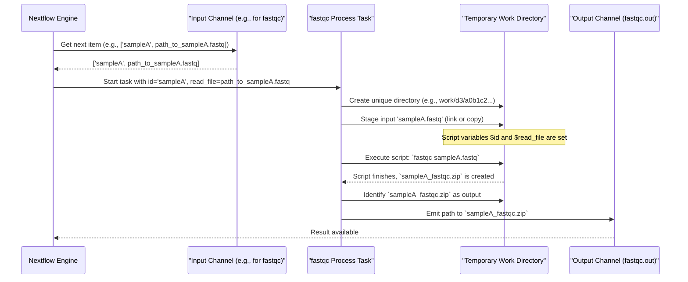

# Chapter 5: Process

Welcome back! In [Chapter 4: Channel](04_channel_.md), we learned how **Channels** act like conveyor belts, carrying our data (files, values) between different stages of our analysis. But what about the actual "workstations" that perform tasks on this data? If channels are the conveyor belts, we now need the specialists who operate the machinery at each station.

In Nextflow, these specialists, these individual task executors, are called **Processes**.

## What is a Process? The Specialist in Your Workshop

A **`process`** is a single, specific computational task or step within your workflow. Think of your entire pipeline as a workshop. A process is like an individual specialist in that workshop assigned a very specific task.
*   One specialist might be excellent at **cutting wood** (e.g., a `TRIM_ADAPTERS` process).
*   Another might be a master **painter** (e.g., an `ALIGN_READS` process).
*   A third might be in charge of **quality checking** the finished parts (e.g., a `RUN_FASTQC` process).

Each specialist (process) typically:
1.  Knows what **materials (inputs)** it needs.
2.  Knows what **tools (command-line software)** it uses.
3.  Follows a specific **set of instructions (script)**.
4.  Produces a defined **product (outputs)**.

In Nextflow, a `process` usually defines how to execute a command-line tool (like FastQC for quality control, or `fastp` for trimming reads) on some input data and how to collect its results.

## Anatomy of a Process: The Specialist's Job Description

To tell Nextflow about a specialist, you define a `process` block. It looks like this:

```groovy
process MY_AWESOME_TASK {
    // Details about the task go here
}
```
`MY_AWESOME_TASK` is the name you give to this particular specialist/process. Inside the curly braces `{}`, you describe its job: its inputs, outputs, and the script it needs to run.

Let's break down the key parts of a process definition:

### 1. Inputs (`input:` block)

This section declares what "materials" or data the process expects to receive. Inputs usually come from [Channel](04_channel_.md)s.

*   `val <variable_name>`: For simple values (like a string or number) from a channel.
*   `path <variable_name>`: For file or directory paths from a channel. Nextflow will make sure these files are available to the process when it runs.
*   `tuple val(...), path(...)`: For when a channel emits composite items (tuples).

```groovy
// Example input block
process PROCESS_FILES {
    input:
    tuple val(sample_id), path(reads_file) from some_input_channel
    val quality_threshold from another_channel // e.g., params.min_quality
}
```
Here, `PROCESS_FILES` expects:
*   `some_input_channel` to provide tuples, where each tuple contains a `sample_id` (a value) and `reads_file` (a file path).
*   `another_channel` to provide a `quality_threshold` (a value).

### 2. Outputs (`output:` block)

This section declares what "products" or results the process will generate. These outputs are then typically sent out on new [Channel](04_channel_.md)s, which can be used by downstream processes.

*   `path "<filename_pattern>"`: Declares an output file. You can use wildcards or variables from the input or script.
*   `stdout`: Captures the standard output of your script and sends it as an item on an output channel.
*   `tuple val(...), path(...)`: To emit composite items (tuples) on an output channel.

```groovy
// Example output block
process PROCESS_FILES {
    // ... inputs from above ...

    output:
    path "results/${sample_id}_processed.txt" // An output file
    path "log_files/${sample_id}.log"
    stdout // Captures anything printed to standard output by the script
}
```
Here, `PROCESS_FILES` will produce:
*   A text file, named using the input `sample_id`.
*   A log file, also named using the input `sample_id`.
*   Any standard output from its script.
Each of these will become an item on one or more output channels (by default, one main output channel named `.out`).

### 3. Script (`script:` block)

This is the heart of the process – the actual commands the specialist executes. It's usually a shell script (like Bash). You can use variables defined in the `input:` block directly in your script using `$variable_name` or `${variable_name}`.

```groovy
// Example script block
process PROCESS_FILES {
    // ... inputs and outputs from above ...

    script:
    """
    echo "Processing sample: ${sample_id}"
    my_tool --input ${reads_file} --quality ${quality_threshold} --output results/${sample_id}_processed.txt > log_files/${sample_id}.log
    echo "Analysis complete for ${sample_id}" // This goes to stdout
    """
}
```
This script:
1.  Prints a message (which won't be part of the declared `path` outputs, but might be captured by `stdout` if not redirected).
2.  Runs `my_tool` using the input `reads_file`, `sample_id`, and `quality_threshold`. It directs the tool's primary output to the declared output file and its standard output/error to the log file.
3.  Prints "Analysis complete..." to standard output, which will be captured by the `stdout` output declaration.

## Our First Process: A Simple Task

Let's create a very simple process that just prints a message.

```groovy
// File: main.nf (or any .nf script)
nextflow.enable.dsl=2 // Good practice for modern Nextflow

process SAY_GREETING {
    output:
    stdout // We want to capture what the script prints

    script:
    """
    echo "Hello from my first Nextflow Process!"
    """
}

workflow {
    SAY_GREETING() // Call the process
    SAY_GREETING.out.view() // View the output channel
}
```
**Explanation:**
*   `process SAY_GREETING { ... }`: We define a process named `SAY_GREETING`.
*   `output: stdout`: We tell Nextflow to capture whatever the script prints to its standard output and put it on an output channel.
*   `script: "echo ..." `: The script simply uses the `echo` command.
*   `workflow { SAY_GREETING() }`: In our workflow, we "call" or invoke this process.
*   `SAY_GREETING.out.view()`: The output channel of `SAY_GREETING` (by default, it's named `.out`) is then viewed.

If you run this, Nextflow will execute the `SAY_GREETING` process, and you'll see an output line similar to:
```
Hello from my first Nextflow Process!
```

## A Process with Inputs and Outputs: The Data Handler

Now, let's make a process that takes some input from a [Channel](04_channel_.md), uses a [Parameter (`params`)](02_parameters___params___.md), and produces an output file.

```groovy
// File: main.nf
nextflow.enable.dsl=2

params.suffix = "_file.txt" // A default parameter

// Channel emitting names
names_channel = Channel.of("Alice", "Bob", "Charlie")

process CREATE_GREETING_FILE {
    input:
    val person_name from names_channel // Takes a name from the channel

    output:
    path "${person_name}${params.suffix}" // Produces a file

    script:
    """
    echo "Greetings, ${person_name}!" > "${person_name}${params.suffix}"
    """
}

workflow {
    CREATE_GREETING_FILE(names_channel) // Pass the channel to the process
    CREATE_GREETING_FILE.out.view { file -> "Generated file: $file" }
}
```
**Explanation:**
*   `params.suffix = "_file.txt"`: We define a pipeline parameter for the file suffix.
*   `names_channel = Channel.of("Alice", "Bob", "Charlie")`: This channel will emit three separate items: "Alice", then "Bob", then "Charlie".
*   `process CREATE_GREETING_FILE { ... }`: Our new process.
    *   `input: val person_name from names_channel`: It expects a value (which we call `person_name`) from the `names_channel`.
    *   `output: path "${person_name}${params.suffix}"`: It will produce a file. The filename is constructed using the input `person_name` and the `params.suffix`.
    *   `script: ...`: The script uses `echo` to write a greeting into the output file.
*   `workflow { CREATE_GREETING_FILE(names_channel) ... }`: We call the process and explicitly pass `names_channel` as its input.
*   `CREATE_GREETING_FILE.out.view { ... }`: We view the output channel of the process, which will emit the paths of the files created.

**What happens when you run this?**
Because `names_channel` emits three items, Nextflow will automatically run the `CREATE_GREETING_FILE` process **three times**, once for each name:
1.  For "Alice": Creates `Alice_file.txt` containing "Greetings, Alice!"
2.  For "Bob": Creates `Bob_file.txt` containing "Greetings, Bob!"
3.  For "Charlie": Creates `Charlie_file.txt` containing "Greetings, Charlie!"

You'll see output like:
```
Generated file: Alice_file.txt
Generated file: Bob_file.txt
Generated file: Charlie_file.txt
```
This automatic parallel execution for each item from an input channel is a key feature of Nextflow!

## Looking at Our Project's Processes

Our tutorial project uses several processes. They are defined in separate files within a `modules/` directory (we'll learn more about this in [Chapter 6: Module System](06_module_system_.md)). Let's peek at simplified versions.

**1. `generate_fastq` (from `modules/fastq/generate.nf`)**
This process creates synthetic FASTQ read files.

```groovy
// Simplified from modules/fastq/generate.nf
process generate_fastq {
    output:
    // Emits a tuple: ("synthetic", path_to_R1_file, path_to_R2_file)
    tuple val("synthetic"), path("synthetic_R1.fastq"), path("synthetic_R2.fastq", optional: true)

    script:
    // Uses params.paired_end and params.num_reads (not shown for brevity)
    // The actual command to generate files would be here.
    // For example:
    // fastq-generator --nb_seq ${params.num_reads} --output synthetic_R1.fastq
    // if (params.paired_end) fastq-generator --nb_seq ${params.num_reads} --output synthetic_R2.fastq
    """
    echo "Generating synthetic R1 FASTQ..." > synthetic_R1.fastq
    if ( ${params.paired_end} ) {
      echo "Generating synthetic R2 FASTQ..." > synthetic_R2.fastq
    } else {
      touch synthetic_R2.fastq // Create an empty R2 if not paired-end, due to 'optional:true'
    }
    """
}
```
*   `output:`: It declares three output items grouped as a `tuple`: a fixed string "synthetic", the path to the first read file (`synthetic_R1.fastq`), and an optional path to a second read file (`synthetic_R2.fastq`).
*   `script:`: The actual script (simplified here) would call a tool like `fastq-generator`. It uses [Parameters (`params`)](02_parameters___params___.md) like `params.paired_end` and `params.num_reads` to control its behavior. The hardcoded path in the original project file (`/Users/alakob/...`) means it's specific to that setup; in a real pipeline, this tool would typically be in your `PATH` or provided by a container.

**2. `fastqc` (from `modules/fastqc/run.nf`)**
This process runs the FastQC tool on a read file.

```groovy
// Simplified from modules/fastqc/run.nf
process fastqc {
    tag "$id" // Helps identify this task in logs, using the 'id' input

    input:
    val publish_dir_param // For specifying output directory, not shown in detail
    tuple val(id), path(read_file) // Expects a tuple: (sample_id, path_to_read_file)

    output:
    path "${read_file.baseName}_fastqc.zip" // Output a zip file from FastQC

    script:
    """
    fastqc ${read_file} // The actual FastQC command
    """
}
```
*   `tag "$id"`: This is a useful directive that labels the process execution in Nextflow's logs, making it easier to track. It uses the `id` variable from the input.
*   `input: tuple val(id), path(read_file)`: It expects input items that are tuples, each containing an `id` (like a sample name) and the `read_file` (the path to the FASTQ file).
*   `output: path "${read_file.baseName}_fastqc.zip"`: FastQC produces a `.zip` file and an `.html` file. Here, we are capturing the `.zip` file. `${read_file.baseName}` gets the filename without its extension.
*   `script: "fastqc ${read_file}"`: The simple command to run FastQC on the input `read_file`.
*   The original file also includes `publishDir`. This directive tells Nextflow to copy the specified output files to a more permanent, user-friendly location once the process completes successfully.

## Under the Hood: How Nextflow Runs a Process

When Nextflow encounters a process that needs to run (because its input data is available):

1.  **Isolation**: Nextflow creates a unique, temporary working directory for that specific task (an instance of the process).
2.  **Staging Inputs**:
    *   If the input is `path file_from_channel`, Nextflow makes `file_from_channel` available in this temporary directory (often by creating a symbolic link to it, which is like a shortcut).
    *   If the input is `val value_from_channel`, the `value_from_channel` is available as a shell variable.
3.  **Script Execution**: The `script:` block is executed as a shell script within this temporary directory.
4.  **Capturing Outputs**: After the script finishes, Nextflow looks for the files/patterns specified in the `output:` block within the temporary directory.
5.  **Sending to Output Channels**: These captured outputs are then sent as items on the process's output [Channel](04_channel_.md)(s).
6.  **Cleanup**: Usually, the temporary directory is cleaned up afterwards (though this can be configured).

Here's a simplified view of one task execution:



## Processes and Configuration (`nextflow.config`)

Remember our [Pipeline Configuration (`nextflow.config`)](03_pipeline_configuration___nextflow_config___.md) file? It plays a crucial role with processes! You can specify default settings (like CPU or memory requirements) or even the Docker/Singularity container a process should run in, without hardcoding it into the process definition itself.

For example, in `nextflow.config`:
```groovy
// File: nextflow.config (snippet)
process {
    withName: 'fastqc' { // Target the process named 'fastqc'
        container = 'biocontainers/fastqc:v0.11.9_cv8' // Specify its Docker container
        cpus = 2 // Tell Nextflow it can use 2 CPUs
    }
    withName: 'generate_fastq' {
        container = null // This process runs locally, no container
    }
}
```
This keeps your process definitions clean and focused on the *what* (the script, inputs, outputs), while `nextflow.config` handles the *how and where* it runs.

## What We've Learned

Processes are the workhorses of your Nextflow pipeline!
*   A `process` defines a **single computational task**, typically running a command-line tool.
*   It has three main parts:
    *   `input:`: Declares expected data, usually from [Channel](04_channel_.md)s.
    *   `output:`: Declares generated results, which go to new [Channel](04_channel_.md)s.
    *   `script:`: Contains the shell commands to be executed.
*   Nextflow **automatically parallelizes** process execution when input channels provide multiple items.
*   Each process task runs in an **isolated temporary directory**.
*   Process behavior (like resource allocation or containers) can be configured via [Pipeline Configuration (`nextflow.config`)](03_pipeline_configuration___nextflow_config___.md).

## Next Steps

We've seen how to define individual specialists (processes). But what if you have a team of specialists that always work together on a common set of tasks? Or what if you want to share your finely-tuned specialist definitions across different projects? That's where Nextflow's module system comes in handy!

Get ready to learn how to organize and reuse your processes with the [Chapter 6: Module System](06_module_system_.md).

---

Generated by [AI Codebase Knowledge Builder](https://github.com/The-Pocket/Tutorial-Codebase-Knowledge)