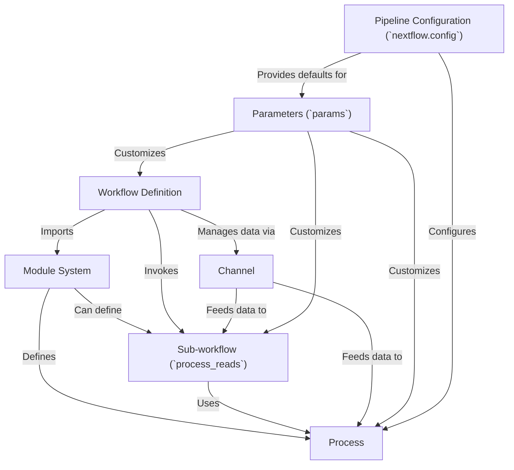

# Tutorial: nextflow

This project demonstrates a **Nextflow pipeline** for *bioinformatics read processing*. It can either *generate synthetic FASTQ reads* or use *existing read files*. The pipeline includes key steps like *quality control* (FastQC) and *adapter/quality trimming* (fastp). It showcases Nextflow's features such as **parameters**, **modules**, and **sub-workflows** for creating *flexible* and *reusable* analysis workflows.

**Source Repository:** [None](None)

## Chapters

1. [Workflow Definition
](01_workflow_definition_.md)
2. [Parameters (`params`)
](02_parameters___params___.md)
3. [Pipeline Configuration (`nextflow.config`)
](03_pipeline_configuration___nextflow_config___.md)
4. [Channel
](04_channel_.md)
5. [Process
](05_process_.md)
6. [Module System
](06_module_system_.md)
7. [Sub-workflow (`process_reads`)
](07_sub_workflow___process_reads___.md)

---

Generated by [AI Codebase Knowledge Builder](https://github.com/The-Pocket/Tutorial-Codebase-Knowledge)