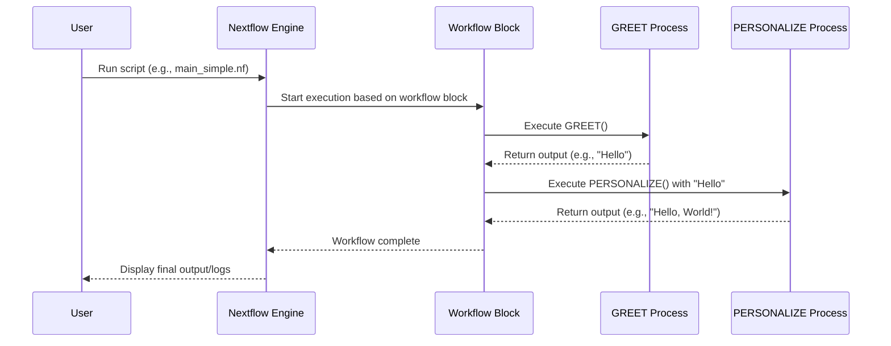

# Chapter 1: Workflow Orchestration

Welcome to your first step in mastering Nextflow! We're thrilled to have you here. In this chapter, we'll explore a fundamental concept that sits at the very heart of Nextflow: **Workflow Orchestration**.

Imagine you're a scientist trying to analyze a large dataset of DNA sequences. Your analysis might involve several steps:
1.  Check the quality of your raw DNA sequences.
2.  Trim away any low-quality parts from these sequences.
3.  Align the cleaned sequences to a reference genome.
4.  Call variants (differences) compared to the reference.

Doing each of these steps manually, one after the other, for many samples can be incredibly time-consuming, error-prone, and difficult to track. What if one step fails? What if you need to re-run everything with a slightly different setting? This is where workflow orchestration comes to the rescue!

**Workflow Orchestration** is like having a master plan or a blueprint for your entire data analysis pipeline. It defines:
*   The sequence of tasks (we call these [Processes](04_process_execution_unit_.md) in Nextflow).
*   How data flows between these tasks (using something called [Channels](03_channel__data_flow__.md)).
*   Any conditional logic (e.g., "if quality is good, proceed; otherwise, stop").

Think of it as a detailed recipe for a multi-course meal. Each dish (a sub-workflow or process) needs to be prepared and combined in a specific order. The main workflow coordinates all these steps to produce the final delicious result – your analyzed data!

## What Problem Does It Solve?

At its core, workflow orchestration solves the problem of **managing complexity in data analysis**. It helps you:
*   **Automate** multi-step analyses.
*   Ensure **reproducibility** (getting the same results if you run it again).
*   Make your analysis **portable** (easy to run on different computers or cloud environments).
*   **Scale** your analysis to handle large datasets and many samples efficiently.

Let's look at a very simple example. Suppose we want to:
1.  Take a greeting message.
2.  Add a name to it.
3.  Print the final personalized greeting.

While this is trivial, it illustrates the core idea of steps and data flowing between them.

## Defining a Workflow in Nextflow

In Nextflow, you define your main orchestration logic within a `workflow { ... }` block in your script (usually `main.nf`).

Let's see a tiny Nextflow script:

```nextflow
// main_simple.nf
nextflow.enable.dsl=2 // Enables a newer, recommended syntax

// Define a simple process (more on this in a later chapter)
process GREET {
    output:
    stdout into greeting_channel // Output will go into 'greeting_channel'

    script:
    """
    echo "Hello"
    """
}

// Define another process
process PERSONALIZE {
    input:
    val base_greeting // Expects some input

    output:
    stdout into personalized_greeting_channel

    script:
    """
    echo "${base_greeting}, World!"
    """
}

// This is our main workflow orchestration!
workflow {
    GREET()                 // Run the GREET process
    PERSONALIZE(GREET.out)  // Run PERSONALIZE, feeding it output from GREET

    // View the final output
    personalized_greeting_channel.view { message ->
        println "Final Message: ${message}"
    }
}
```

Let's break down the `workflow` block:
1.  `GREET()`: This line calls our first process named `GREET`. It runs and produces an output.
2.  `PERSONALIZE(GREET.out)`: This line calls the `PERSONALIZE` process. Crucially, `GREET.out` takes the output from the `GREET` process and feeds it as input to `PERSONALIZE`. This is how data flows!
3.  `personalized_greeting_channel.view { ... }`: This takes the final output and prints it to the screen.

When you run this script (e.g., `nextflow run main_simple.nf`), Nextflow understands this plan and executes the processes in the correct order, handling the data transfer automatically. The output would be:

```
N E X T F L O W  ~  version ...
Launching `main_simple.nf` [some_name] - revision: ...
Final Message: Hello, World!
```

This "master plan" is the essence of workflow orchestration. You define *what* needs to happen and *how data connects the steps*, and Nextflow takes care of the execution.

## A Peek Under the Hood: How Nextflow Orchestrates

When you execute a Nextflow script, the Nextflow engine reads your `workflow` block and builds an execution plan.

Here’s a simplified step-by-step:

1.  **Parse the Script:** Nextflow reads your `main.nf` file (and any imported modules).
2.  **Identify Tasks:** It identifies all the processes and sub-workflows you've defined.
3.  **Determine Dependencies:** It looks at how the outputs of some tasks become the inputs of others. This creates a dependency graph (a map of what needs to run before what).
4.  **Execute Tasks:** Nextflow starts executing tasks that have their inputs ready. As tasks complete, their outputs become available, potentially triggering the execution of downstream tasks.
5.  **Manage Data Flow:** It seamlessly manages the [Channels](03_channel__data_flow__.md) that carry data between [Processes](04_process_execution_unit_.md).

Let's visualize this with a sequence diagram:



This diagram shows how the Nextflow Engine uses your `workflow` definition to coordinate the execution of individual processes.

## Orchestration in Our Project (`main.nf`)

Now, let's look at the main workflow definition in our course project's `main.nf` file. Don't worry about understanding every single line yet; focus on the `workflow { ... }` block and how it defines the high-level plan.

```nextflow
// From: main.nf (simplified view)
nextflow.enable.dsl=2

// ... (parameter definitions and module imports are here) ...
// params.generate_reads, params.reads, etc. are [Pipeline Parameters](02_pipeline_parameters___params___.md)
// include { generate_fastq } ... are [Modular Components](06_modular_components__modules__.md)

// Main workflow definition
workflow {
    // Step 1: Decide where our input data comes from
    if (params.generate_reads) {
        generate_fastq() // This is a process call
        input_channel = generate_fastq.out
    } else {
        // Logic to use existing files (simplified here)
        // input_channel = Channel.fromFilePairs(...) or Channel.fromPath(...)
        // This creates a [Channel (Data Flow)](03_channel__data_flow__.md)
    }

    // Step 2: Process the reads using a sub-workflow
    process_reads(input_channel)
}
```
In this `workflow` block:
1.  **Conditional Input:** An `if (params.generate_reads)` statement decides how to get the initial data.
    *   If `params.generate_reads` is true, it calls the `generate_fastq()` [Process](04_process_execution_unit_.md) (defined in a module) to create synthetic DNA sequence data. The output of this process (`generate_fastq.out`) becomes our `input_channel`.
    *   Otherwise, it uses [Pipeline Parameters (`params`)](02_pipeline_parameters___params___.md) like `params.reads` to create an `input_channel` from existing files.
2.  **Call a Sub-Workflow:** `process_reads(input_channel)` is the core processing step. Notice that `process_reads` is itself defined as a `workflow` (a sub-workflow) elsewhere in the `main.nf` file. This is a powerful feature: you can nest workflows to organize complex pipelines.

Let's look at the `process_reads` sub-workflow, which is orchestrated by our main workflow:

```nextflow
// From: main.nf
// Definition of the 'process_reads' sub-workflow
workflow process_reads {
    take:
        input_channel  // Declares it expects an input_channel

    main:
        // 1. Quality control on raw reads (simplified call)
        fastqc_raw_wf("${params.outdir}/fastqc_raw", input_channel)

        // 2. Trim reads
        trimming = fastp_trim(input_channel) // Call fastp_trim process

        // 3. Quality control on trimmed reads (simplified call)
        fastqc_trimmed_wf("${params.outdir}/fastqc_trimmed", trimming)
    
    emit:
        trimmed // Output from this sub-workflow
}
```
The `process_reads` sub-workflow itself orchestrates several steps:
*   It takes `input_channel` (which came from the main workflow).
*   It calls `fastqc_raw_wf` (another sub-workflow, defined in `./modules/fastqc/workflow.nf`) to perform an initial quality check.
*   It calls `fastp_trim` (a [Process](04_process_execution_unit_.md) defined in `./modules/fastp/trim.nf`) to trim the reads.
*   It then calls `fastqc_trimmed_wf` to check the quality of the trimmed reads.

So, our main `workflow` block acts as the top-level conductor, deciding on the input and then handing off the main processing tasks to the `process_reads` sub-workflow. The `process_reads` sub-workflow then conducts its own smaller orchestra of quality control and trimming tasks.

The files like `./modules/fastq/generate.nf` or `./modules/fastp/trim.nf` contain the definitions for individual [Processes](04_process_execution_unit_.md), which are like the individual musicians or chefs performing specific tasks. We'll learn all about them in [Chapter 4: Process Execution Unit](04_process_execution_unit_.md).

The beauty of this is that you can define complex interactions and dependencies in a clear, structured way. Nextflow figures out the order, manages data transfer, and can even run independent tasks in parallel!

## Reusing Orchestration Logic

Our `main.nf` file also contains other named workflows like `generate_single_end`, `existing_paired_end`, etc.

```nextflow
// From: main.nf (example of another named workflow)
workflow generate_single_end {
    // Set specific parameters for this scenario
    params.paired_end = false
    params.generate_reads = true
    
    // Generate reads (specific to this scenario if needed, or uses main logic)
    generate_fastq()
    input_channel = generate_fastq.out
    
    // ** Reuse the main processing logic **
    process_reads(input_channel)
}
```
Notice how `generate_single_end` sets some specific [Pipeline Parameters (`params`)](02_pipeline_parameters___params___.md), prepares its input, and then *calls the same `process_reads` sub-workflow*. This is a powerful way to reuse your core data processing logic for different scenarios or entry points, all orchestrated by Nextflow. You can run this specific workflow by typing `nextflow run main.nf -entry generate_single_end`.

## Conclusion

Workflow orchestration is the backbone of any Nextflow pipeline. It's the "master plan" that tells Nextflow:
*   What tasks to run.
*   In what order.
*   How data should flow between them.
*   How to handle choices and conditions.

By defining a `workflow` block, you instruct Nextflow on how to manage your complex analysis, turning a potentially chaotic series of manual steps into an automated, reproducible, and scalable pipeline. You've seen how a main workflow can call processes and even other sub-workflows, creating a hierarchical and organized structure.

You've taken your first exciting step! Now that you understand how a workflow is structured at a high level, you might be wondering how to control its behavior with different inputs or settings. That's exactly what we'll cover next!

Ready to learn how to customize your workflow's behavior without changing the script itself? Let's dive into [Pipeline Parameters (`params`)](02_pipeline_parameters___params___.md).

---

Generated by [AI Codebase Knowledge Builder](https://github.com/The-Pocket/Tutorial-Codebase-Knowledge)