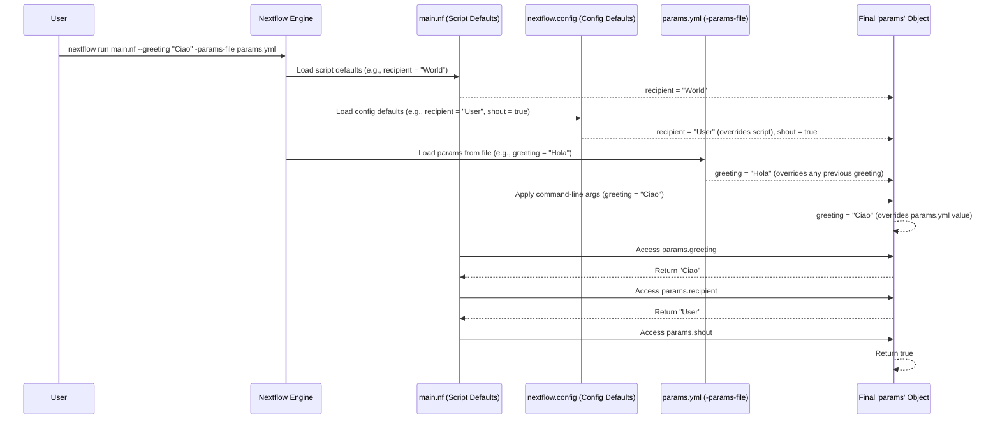

# Chapter 2: Pipeline Parameters (`params`)

In [Chapter 1: Workflow Orchestration](01_workflow_orchestration_.md), we learned how Nextflow helps us define a "master plan" for our data analysis, outlining the sequence of tasks and how data flows between them. But what if you want to run the same analysis plan with different input files, or save the results to a different folder, or tweak a specific setting like the number of reads to simulate? You wouldn't want to edit the pipeline script every single time! This is where Pipeline Parameters come in handy.

Imagine your pipeline is like a complex appliance, say, a high-tech coffee maker. It has a fixed way of working (the "workflow"), but you can adjust various dials and settings: the strength of the coffee, the number of cups, whether to use beans or pre-ground coffee. **Pipeline Parameters (`params`)** in Nextflow are exactly like these dials and settings. They allow you to control the behavior of your pipeline from the outside, without changing its underlying code.

## What Problem Do `params` Solve?

Pipeline parameters make your workflows **flexible and reusable**. Instead of hard-coding values like file paths, output directories, or tool-specific options directly into your pipeline script, you define them as parameters. This allows you (or anyone else using your pipeline) to easily:

*   Specify different input data.
*   Direct output to different locations.
*   Adjust settings for tools or processes.
*   Toggle features on or off.

For example, in our DNA sequencing analysis project, we might want to:
*   Use different raw DNA sequence files as input.
*   Change the name of the directory where results are saved.
*   Control whether the pipeline generates synthetic test data or uses existing data.

Using `params`, we can do all this just by changing a command when we run the pipeline, not by editing the `main.nf` script itself.

## Defining Parameters: Setting the Defaults

Parameters usually have **default values**. These are the settings your pipeline will use if you don't specify otherwise when you run it. Think of them as the factory settings on your coffee maker.

You can define default parameters in two main places:

1.  **Directly in your Nextflow script (e.g., `main.nf`)**:
    This is good for parameters that are very specific to the logic of that script. You define them using the `params` object.

    ```nextflow
    // main_example.nf
    nextflow.enable.dsl=2

    // Define default parameters
    params.greeting = "Hello"
    params.recipient = "World"
    params.shout = false

    process SAY_HI {
        script:
        """
        MESSAGE="${params.greeting}, ${params.recipient}"
        if ${params.shout}; then
            echo "\${MESSAGE}!!!"
        else
            echo "\${MESSAGE}."
        fi
        """
    }

    workflow {
        SAY_HI()
    }
    ```
    In this script:
    *   `params.greeting` is set to "Hello" by default.
    *   `params.recipient` is set to "World" by default.
    *   `params.shout` is a boolean (true/false) parameter, defaulting to `false`.

2.  **In the `nextflow.config` file**:
    This is the **recommended place for most default parameters**, especially those that might be common across different parts of your project or that users are likely to change. It keeps your main script cleaner. Parameters are defined within a `params { ... }` block.

    Let's create a `nextflow.config` file:
    ```nextflowconfig
    // nextflow.config
    params {
        greeting = "Hi there"
        recipient = "Nextflow User"
        shout = true
        outdir = "pipeline_results" // A common parameter!
    }
    ```
    If you have the same parameter defined in both `main.nf` and `nextflow.config`, the value in `nextflow.config` usually takes precedence for the default.

## Using Parameters in Your Pipeline

Once defined, you can access parameters anywhere in your pipeline script (workflows, processes) using the `params` object, followed by a dot and the parameter name (e.g., `params.greeting`).

Look at the `SAY_HI` process from our `main_example.nf` script again:

```nextflow
// Part of main_example.nf
process SAY_HI {
    script:
    """
    MESSAGE="${params.greeting}, ${params.recipient}" // Using params
    if ${params.shout}; then                         // Using another param
        echo "\${MESSAGE}!!!"
    else
        echo "\${MESSAGE}."
    fi
    """
}
```
When this process runs, Nextflow will substitute `${params.greeting}` with the current value of the `greeting` parameter, and so on.

If you run `nextflow run main_example.nf` (assuming the `nextflow.config` above is present):
*   `params.greeting` will be "Hi there" (from `nextflow.config`).
*   `params.recipient` will be "Nextflow User" (from `nextflow.config`).
*   `params.shout` will be `true` (from `nextflow.config`).

The output would be:
```
N E X T F L O W  ~  version ...
Launching `main_example.nf` [some_funky_name] - revision: ...
executor > local (1)
[process_id] process > SAY_HI [100%] 1 of 1 ✔
Hi there, Nextflow User!!!
```

## Overriding Parameters at Runtime: Turning the Dials!

This is where `params` truly shine! You can easily change their values when you launch the pipeline, without touching the script code. The most common way is via the command line.

To override a parameter, you use a double-hyphen (`--`) followed by the parameter name and its new value:
`nextflow run <your_script.nf> --parameter_name new_value`

Let's try it with our `main_example.nf` and `nextflow.config`:

1.  **Override `greeting` and `recipient`**:
    ```bash
    nextflow run main_example.nf --greeting "Bonjour" --recipient "Monde"
    ```
    Output:
    ```
    N E X T F L O W  ~  version ...
    Launching `main_example.nf` [another_name] - revision: ...
    executor > local (1)
    [process_id] process > SAY_HI [100%] 1 of 1 ✔
    Bonjour, Monde!!!
    ```
    Notice how `params.greeting` and `params.recipient` used the values from the command line, while `params.shout` still used its default `true` from `nextflow.config`.

2.  **Override the boolean `shout` parameter**:
    Boolean parameters can be set to `false` like this: `--shout false`. If you just specify the flag like `--shout`, it's often interpreted as `true` (though explicitly setting it to `true` as `--shout true` is clearer).
    ```bash
    nextflow run main_example.nf --shout false --recipient "Quiet Friend"
    ```
    Output:
    ```
    N E X T F L O W  ~  version ...
    Launching `main_example.nf` [silent_run] - revision: ...
    executor > local (1)
    [process_id] process > SAY_HI [100%] 1 of 1 ✔
    Hi there, Quiet Friend.
    ```
    Now it speaks normally because `params.shout` was overridden to `false`.

You can also specify parameters in a separate YAML or JSON file and tell Nextflow to use it with the `-params-file` option. This is useful when you have many parameters to set.

For example, create `my_settings.yml`:
```yaml
# my_settings.yml
greeting: "Hola"
recipient: "Amigo"
shout: true
```
Then run:
```bash
nextflow run main_example.nf -params-file my_settings.yml
```
This would output: `Hola, Amigo!!!`

## How Nextflow Determines Parameter Values

When Nextflow starts, it figures out the final value for each parameter by looking at different sources in a specific order of precedence (what overrides what):

1.  **Script Defaults**: Values defined directly in your `.nf` script (e.g., `params.greeting = "Hello"`). These are the lowest precedence.
2.  **`nextflow.config` Defaults**: Values defined in the `params { ... }` block of your [Configuration (`nextflow.config`)](05_configuration___nextflow_config___.md) file. These override script defaults.
3.  **`-params-file`**: Values provided in a YAML or JSON file specified with `-params-file`. These override `nextflow.config` and script defaults.
4.  **Command-Line Arguments**: Values specified with `--param_name value` on the command line. These have the **highest precedence** and override all other sources.

Let's see this in a diagram:


This diagram illustrates that the command-line option (`--greeting "Ciao"`) ultimately set the value for `params.greeting`, overriding the value from `params.yml`, which in turn would have overridden any default from `nextflow.config` or the script itself.

## Parameters in Our Project

Let's look at how parameters are used in our course project.

**In `main.nf`:**
At the top of our `main.nf` file, we define several default parameters:
```nextflow
// From: main.nf
// Parameters
params.reads = "data/reads/*_{1,2}.fastq"  // Path to existing reads
params.paired_end = true                      // For paired-end reads
params.outdir = "results"                     // Output directory
params.generate_reads = true                // Generate new reads?
params.single_end_reads = null                // For existing single-end
```
*   `params.reads`: Specifies the pattern for input read files if `params.generate_reads` is false.
*   `params.paired_end`: A boolean to indicate if the reads are paired-end or single-end.
*   `params.outdir`: The directory where all results should be saved.
*   `params.generate_reads`: A boolean that controls whether the pipeline generates synthetic FASTQ files or uses existing ones.

**In `nextflow.config`:**
Our `nextflow.config` file also defines some default parameters:
```nextflowconfig
// From: nextflow.config
// Default parameters
params {
    // Number of reads to generate
    num_reads = 1000
    
    // Default publish directory used in fastqc module
    publish_dir = null
}
```
*   `params.num_reads`: If we are generating reads, this controls how many.
*   `params.publish_dir`: A general parameter that some modules might use to decide where to publish their specific results.

**How they are used:**
These parameters control various aspects of the pipeline. For instance, in the main `workflow` block of `main.nf`:
```nextflow
// From: main.nf (simplified)
workflow {
    if (params.generate_reads) { // Using the 'generate_reads' parameter
        generate_fastq()
        input_channel = generate_fastq.out
    } else {
        // Logic here uses params.reads and params.paired_end
        // to find and prepare existing input files.
    }

    // ...
    // The 'process_reads' sub-workflow will eventually use params.outdir
    // for saving results, e.g., via fastqc_raw_wf
    // fastqc_raw_wf("${params.outdir}/fastqc_raw", ...)
    process_reads(input_channel)
}
```
The `generate_fastq` process itself (defined in `modules/fastq/generate.nf`) uses `params.num_reads` and `params.paired_end`:
```nextflow
// From: modules/fastq/generate.nf (simplified script part)
process generate_fastq {
    script:
    if (params.paired_end) { // Using params.paired_end
        """
        fastq-generator ... --nb_seq ${params.num_reads ?: 1000} ...
        fastq-generator ... --nb_seq ${params.num_reads ?: 1000} ...
        """
    } else {
        """
        fastq-generator ... --nb_seq ${params.num_reads ?: 1000} ...
        """
    }
}
```
This means you can control read generation details right from the command line:
```bash
# Run the pipeline, but don't generate reads; use existing ones from 'my_data/'
# and output results to 'my_rnaseq_run_1'
nextflow run main.nf --generate_reads false \
                     --reads "my_data/*_R{1,2}.fastq.gz" \
                     --outdir "my_rnaseq_run_1"

# Run the pipeline, generate 500 single-end reads
nextflow run main.nf --generate_reads true \
                     --paired_end false \
                     --num_reads 500 \
                     --outdir "test_run_se_500"
```
See how powerful this is? The same `main.nf` script can behave very differently based on the parameters you provide!

## Conclusion

Pipeline Parameters (`params`) are your best friend for creating flexible, reusable, and user-friendly Nextflow pipelines. They act as configurable "dials" that let you:
*   Define sensible default behaviors for your pipeline.
*   Easily override these defaults at runtime using command-line arguments or parameter files.
*   Control aspects like input data, output locations, and tool settings without modifying the pipeline's core logic.

By understanding and using `params`, you're making your pipelines much more adaptable to different scenarios and easier for others (and your future self!) to use.

Now that we know how to plan our workflow (Chapter 1) and how to configure its behavior with parameters (Chapter 2), how does the actual data move from one step to the next in our plan? That's where we'll discover the magic of [Channel (Data Flow)](03_channel__data_flow__.md).

---

Generated by [AI Codebase Knowledge Builder](https://github.com/The-Pocket/Tutorial-Codebase-Knowledge)