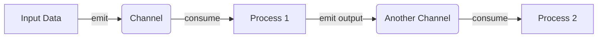
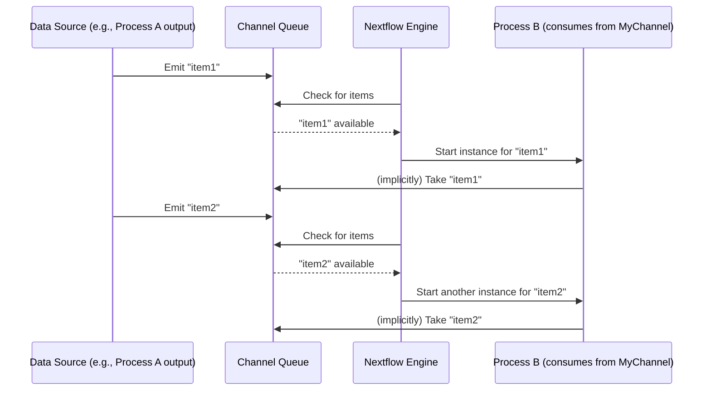

# Chapter 3: Channel (Data Flow)

In [Chapter 2: Pipeline Parameters (`params`)](02_pipeline_parameters___params__.md), we saw how to make our pipelines flexible by using `params` to change settings like input files or output directories without altering the script. Now, once we have our inputs (maybe a list of data files), how does this data actually *move* from one processing step to the next in our pipeline's plan? This is where **Channels** come into play.

Imagine your pipeline is a small assembly line in a toy factory.
*   You have a box of raw materials (e.g., different colored plastic blocks – these are your input data files).
*   You have several workstations: one for molding, one for painting, one for assembly (these are your [Processes](04_process_execution_unit_.md)).

How do the plastic blocks get from the raw material box to the molding station, then to the painting station, and finally to assembly? You'd use **conveyor belts**! In Nextflow, **Channels are these conveyor belts**.

## What Problem Do Channels Solve?

Channels are the communication pathways that move data between processes or workflow steps. They ensure that data is passed in an organized and, crucially, an **asynchronous** manner. This "asynchronous" part is key: it means that a process doesn't have to wait for *all* previous steps to finish on *all* data items before it can start working on items that are ready. It's like a conveyor belt that keeps moving items along as soon as they are available.

The main problems channels solve are:
1.  **Connecting processes**: They provide a clear way to define that the output of process A should become the input of process B.
2.  **Handling multiple data items**: If you have many input files (e.g., 100 samples), channels manage sending each one through the pipeline.
3.  **Enabling parallelism**: Because channels can feed data items to processes as they become available, Nextflow can often run multiple instances of a process in parallel, each working on a different data item from the channel. This speeds up your pipeline significantly!

## What is a Channel?

A Channel in Nextflow is essentially a **queue** that can hold and transmit data items. These data items can be simple values (like numbers or strings), file paths, or even more complex collections of data (like a group of files for a single sample).

Think of a channel as a one-way street for data:
*   Data items **enter** the channel (we say they are "emitted" into the channel).
*   Data items **travel** along the channel.
*   Processes can **read** or "consume" data items from the channel to do their work.



## Creating Channels: Loading the Conveyor Belt

There are several ways to create channels and put data onto them.

**1. From Explicit Values (Simple Data)**

You can create a channel directly from a list of values using `Channel.of()` or `Channel.fromList()`. This is useful for simple data or for testing.

```nextflow
// Create a channel with three numbers
number_channel = Channel.of(10, 20, 30)

// You can "view" a channel to see its contents (for debugging)
number_channel.view { item -> "Next item is: ${item}" }
```
When you run this, `view()` will print each item as it "flows" through:
```
Next item is: 10
Next item is: 20
Next item is: 30
```
Each number (10, 20, 30) is an individual item on the `number_channel` conveyor belt.

**2. From File Paths**

A very common use case is to create a channel from a set of input files. `Channel.fromPath()` is perfect for this. It can take a file path or a glob pattern (like a wildcard) to find multiple files.

```nextflow
// Assume you have files: data/sampleA.txt, data/sampleB.txt
// and an empty directory data/empty_dir/

// Create a channel from files matching a pattern in the 'data' directory
file_channel = Channel.fromPath( "data/sample*.txt" )
file_channel.view { file_path -> "Found file: ${file_path}" }
```
This would create a channel where each item is a `Path` object representing a file. The output would be:
```
Found file: data/sampleA.txt
Found file: data/sampleB.txt
```
Notice that `data/empty_dir/` or other non-matching files would not be included.

For paired-end sequencing data, where you have pairs of files (e.g., `sample1_R1.fastq`, `sample1_R2.fastq`), `Channel.fromFilePairs()` is incredibly useful. It groups these pairs for you. We'll see this in our project code.

**3. From Process Outputs (The Most Common Way!)**

Processes (the "workstations" in our factory) do work and produce results. These results are typically outputted into channels.

In a [Process Execution Unit](04_process_execution_unit_.md) definition, you declare `output` blocks. These outputs *become* channels.

```nextflow
// main_channel_example.nf
nextflow.enable.dsl=2

process GENERATE_DATA {
    output:
    stdout into data_items_ch // 'data_items_ch' is now a channel

    script:
    """
    echo "apple"
    echo "banana"
    """
}

workflow {
    GENERATE_DATA() // Run the process

    // View the channel created by the process output
    data_items_ch.view { item -> "Fruit from process: ${item}" }
}
```
When you run `nextflow run main_channel_example.nf`:
1.  `GENERATE_DATA` runs. Its script prints "apple" then "banana" to standard output.
2.  The `stdout into data_items_ch` declaration captures this standard output. Each line becomes an item in `data_items_ch`.
3.  The `view()` operator then prints:
    ```
    Fruit from process: apple
    Fruit from process: banana
    ```
So, `data_items_ch` is a channel automatically created and populated by the `GENERATE_DATA` process.

## Consuming Channels: Taking Items from the Conveyor Belt

Processes also use `input` blocks to declare what data they expect from channels.

```nextflow
// (Continuing main_channel_example.nf)
process PROCESS_FRUIT {
    input:
    val fruit_name from data_items_ch // Expects items from data_items_ch

    script:
    """
    echo "Processing ${fruit_name}..."
    """
}
```
Here, `PROCESS_FRUIT` declares it needs an input, which it names `fruit_name`, and that this input will come `from data_items_ch`.

## Connecting Processes: The Data Flow

Now, let's connect `GENERATE_DATA` and `PROCESS_FRUIT` in a [Workflow Orchestration](01_workflow_orchestration_.md):

```nextflow
// (Continuing main_channel_example.nf)
workflow {
    GENERATE_DATA()              // This creates data_items_ch implicitly
    PROCESS_FRUIT(data_items_ch) // Pass data_items_ch to PROCESS_FRUIT

    // Or, more explicitly, using the process output reference:
    // PROCESS_FRUIT(GENERATE_DATA.out)
    // If a process has only one output channel, .out refers to it.
    // If it has multiple named output channels, like 'stdout into my_channel',
    // you'd use GENERATE_DATA.out.my_channel
}
```
When this workflow runs:
1.  `GENERATE_DATA()` is called. It produces "apple" and "banana" into its output channel, which we've named `data_items_ch` (or it could be accessed via `GENERATE_DATA.out.data_items_ch` or just `GENERATE_DATA.out` if it's the only/primary output).
2.  `PROCESS_FRUIT(data_items_ch)` is called. Nextflow sees that `PROCESS_FRUIT` expects input from `data_items_ch`.
3.  For **each item** in `data_items_ch` ("apple", then "banana"), Nextflow will trigger an instance of `PROCESS_FRUIT`.
    *   The first instance gets "apple" as `fruit_name`.
    *   The second instance gets "banana" as `fruit_name`.
4.  The output would be (order might vary due to parallelism):
    ```
    Processing apple...
    Processing banana...
    ```
This is the essence of data flow in Nextflow! The output channel of one process becomes the input channel for another.

## Channels and Parallelism: The Magic of Asynchronicity

This "one item, one process instance" behavior is powerful. If `data_items_ch` had 100 fruits, Nextflow could potentially run 100 `PROCESS_FRUIT` tasks in parallel (if your computer resources allow), each handling one fruit. The channel acts as a buffer, feeding tasks as they become ready. You don't need to write complex loops; Nextflow handles the distribution of data from the channel to the process instances.

This is what "asynchronous" means in this context: `PROCESS_FRUIT` doesn't wait for `GENERATE_DATA` to produce *all* its fruits. As soon as `GENERATE_DATA` produces "apple", `PROCESS_FRUIT` can start working on "apple". While `PROCESS_FRUIT` is busy with "apple", `GENERATE_DATA` might produce "banana", which can then be picked up by another instance of `PROCESS_FRUIT`.

## A Peek Under the Hood: How Channels Work

Internally, Nextflow uses a robust system of queues to manage channels.

1.  **Emission**: When a process output (`stdout into my_channel`) or a channel factory (`Channel.of(1,2,3)`) produces an item, that item is placed into an internal queue associated with the channel (`my_channel`).
2.  **Subscription**: When a process declares an input from a channel (`val x from my_channel`), it "subscribes" to that channel.
3.  **Dispatch**: Nextflow's engine monitors these queues. When an item arrives in a queue and a subscribed process is ready to accept new tasks, Nextflow "dispatches" the item to an instance of that process.
4.  **Execution**: The process instance executes with the received item.
5.  **Completion & Repeat**: Once the process instance finishes, it might produce output for another channel, and it signals to Nextflow that it's ready for more work (if there are more items in its input channel).

Let's visualize this with a simplified sequence diagram:



This shows how the Nextflow Engine acts as a coordinator, taking items from the channel queue (where the upstream process puts them) and dispatching them to instances of the downstream process.

## Channels in Our Project (`main.nf`)

Let's see how channels are used in our course project's `main.nf`.

**1. Creating the Initial Input Channel:**
In the main `workflow` block, we create `input_channel` one of two ways:

```nextflow
// From: main.nf (simplified workflow block)
workflow {
    if (params.generate_reads) {
        generate_fastq() // This process is defined in a module
        // generate_fastq.out IS the channel holding generated read files
        input_channel = generate_fastq.out
    } else {
        // Channel.fromFilePairs creates a channel from existing files
        // It groups paired-end reads (e.g., _R1.fastq, _R2.fastq)
        input_channel = Channel.fromFilePairs(params.reads, size: 2)
                             // .map is an operator that transforms channel items
                             .map { id, files -> tuple(id, files[0], files[1]) }
    }
    // ...
}
```
*   If `params.generate_reads` is true, the `generate_fastq` process runs. Its output (defined in `modules/fastq/generate.nf`) automatically becomes a channel, which we assign to `input_channel`. This channel will emit one item per sample, typically a tuple like `[sample_id, read1_file, read2_file]`.
*   If `params.generate_reads` is false, `Channel.fromFilePairs(params.reads, size: 2)` creates a channel. For each pair of files found matching `params.reads`, it emits a tuple like `[ 'sample_prefix', [file('/path/to/sample_R1.fastq'), file('/path/to/sample_R2.fastq')] ]`.
    The `.map { ... }` part is a channel *operator* (a more advanced topic for later) that transforms each emitted item into the desired `tuple(id, files[0], files[1])` format, consistent with `generate_fastq.out`.

**2. Passing Channels to Sub-Workflows:**
The `input_channel` is then passed to the `process_reads` sub-workflow:

```nextflow
// Still in main.nf's main workflow block
    process_reads(input_channel) // The channel is passed as an argument
```

**3. Sub-Workflows Receiving Channels:**
The `process_reads` sub-workflow declares that it `take`s (receives) this channel:

```nextflow
// From: main.nf (definition of 'process_reads' sub-workflow)
workflow process_reads {
    take:
        input_channel  // Declares it expects 'input_channel'

    main:
        // 'input_channel' is now available to be used here
        trimming = fastp_trim(input_channel) // fastp_trim gets data from input_channel
        
        // ... other steps like fastqc_raw_wf also use input_channel or derived channels
        fastqc_raw_wf("${params.outdir}/fastqc_raw", input_channel.flatMap { id, r1, r2 -> ... })
}
```
Inside `process_reads`, the `input_channel` (which holds our raw read data for each sample) is then fed into the `fastp_trim` process. The `fastp_trim` process will run once for each item (each sample's read pair) emitted by `input_channel`. Similarly, `fastqc_raw_wf` (another sub-workflow) receives data derived from `input_channel`.

The output of `fastp_trim` (which is itself a channel containing trimmed reads) is assigned to the `trimming` variable. This `trimming` channel is then used as input for `fastqc_trimmed_wf`.

This chain – output of one process becoming input to another via channels – is the fundamental way data flows through a Nextflow pipeline.

## Conclusion

Channels are the lifelines of a Nextflow pipeline. They are the "conveyor belts" that:
*   Carry data items (values, files, etc.) between your processing steps.
*   Enable Nextflow to manage complex data dependencies automatically.
*   Allow for powerful parallel execution by feeding data to multiple process instances concurrently.

You've learned:
*   What channels are and why they are important.
*   How to create channels from values, file paths, and (most importantly) process outputs.
*   How processes consume data from channels.
*   How connecting process outputs to process inputs via channels defines the data flow.

Understanding channels is crucial for building even moderately complex pipelines. They are the mechanism that turns a static list of tasks into a dynamic, flowing, and efficient data processing system.

Now that we know how data *flows* using channels, what about the "workstations" themselves? What exactly is a "process" and how do we define the work it performs? Let's dive into the [Process Execution Unit](04_process_execution_unit_.md) in the next chapter!

---

Generated by [AI Codebase Knowledge Builder](https://github.com/The-Pocket/Tutorial-Codebase-Knowledge)