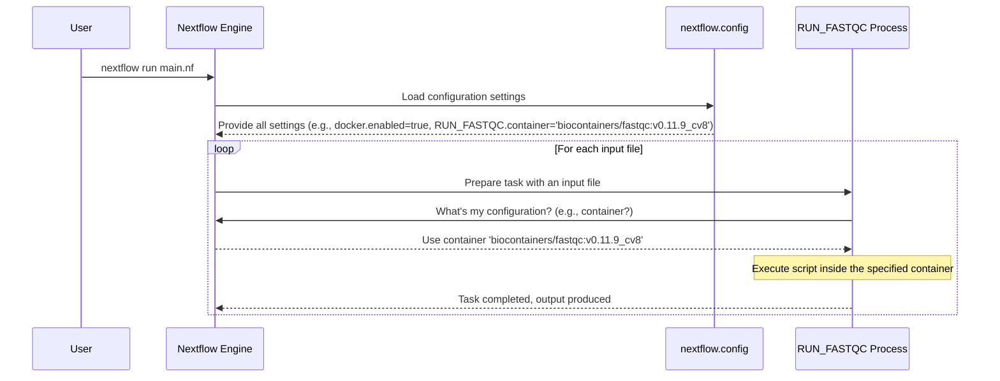

# Chapter 5: Configuration (`nextflow.config`)

Welcome to Chapter 5! In [Chapter 4: Process Execution Unit](04_process_execution_unit_.md), we explored how **Processes** are the workhorses of our Nextflow pipeline, executing specific tasks like trimming reads or running quality control. We saw how each process runs a script and manages its own inputs and outputs.

But what if you want to set global rules for your pipeline? For example:
*   How much memory or CPU should most tasks use by default?
*   Which specific software version (packaged in a Docker container) should be used for the `fastqc` tool across the entire pipeline?
*   Where should results be published by default?

You wouldn't want to specify these settings inside every single `process` script. That would be repetitive and hard to manage. This is where the **`nextflow.config`** file comes to the rescue!

Think of your Nextflow pipeline as a sophisticated factory. The `main.nf` script is like the blueprint for your assembly line (the [Workflow Orchestration](01_workflow_orchestration_.md)), and each `process` is a specific machine on that line. The `nextflow.config` file is like the **central control panel** for the entire factory. It allows you to set global defaults, specify which tools to use, and manage the overall execution environment.

## What Problem Does `nextflow.config` Solve?

The `nextflow.config` file helps you **separate your pipeline's logic from its execution environment and global settings**. This makes your pipeline:

*   **More portable**: Easier to run on different systems (your laptop, a high-performance cluster, the cloud) by simply changing the configuration, not the pipeline script.
*   **More manageable**: Centralizes settings like software versions (via containers) and resource allocations.
*   **Clearer**: Keeps your main pipeline script (`main.nf`) focused on the workflow logic, not bogged down with environment details.

For instance, imagine you're running a pipeline that uses the `FastQC` tool. You want to ensure everyone running your pipeline uses version `0.11.9_cv8` of `FastQC`, packaged in a specific Docker container. Instead of hardcoding this into the `FastQC` process definition, you specify it in `nextflow.config`. If you later need to update to a newer version of `FastQC`, you only change it in one place: the `nextflow.config` file.

## The `nextflow.config` File

The `nextflow.config` file is a plain text file, typically named `nextflow.config`, that you place in the root directory of your Nextflow project. Nextflow automatically reads this file when it starts.

It uses a syntax similar to Groovy (the language Nextflow scripts are written in), but for configuration, it mostly involves simple assignments of values to settings.

Let's look at some key "sections" or "scopes" you can use within `nextflow.config`:

**1. `params` Scope: Default Pipeline Parameters**
As we saw in [Chapter 2: Pipeline Parameters (`params`)](02_pipeline_parameters___params___.md), you can define default values for your pipeline parameters in `nextflow.config`.

```nextflowconfig
// nextflow.config
params {
    outdir = "pipeline_results"
    num_reads = 500 // Default number of reads to generate
}
```
This sets `params.outdir` to "pipeline_results" and `params.num_reads` to 500 if they are not overridden on the command line.

**2. `docker` Scope: Docker Settings**
If you use Docker containers to manage your software dependencies (which is highly recommended for reproducibility!), you can configure Docker behavior here.

```nextflowconfig
// nextflow.config
docker {
    enabled = true // Tells Nextflow to use Docker for processes
    // This option helps Docker run correctly on some computers, like Apple Silicon Macs
    runOptions = '--platform=linux/amd64'
}
```
*   `docker.enabled = true`: Globally enables Docker. Nextflow will try to run processes that have a container specified within a Docker container.

**3. `process` Scope: Settings for Processes**
This is a very powerful scope. You can define default settings for all [Process Execution Unit](04_process_execution_unit_.md)s, or specify settings for individual processes by their name.

   **a. General Process Settings:**
   You can set defaults that apply to *all* processes unless overridden.

   ```nextflowconfig
   // nextflow.config
   process {
       cpus = 1          // Default: request 1 CPU for each task
       memory = '1.GB'   // Default: request 1 Gigabyte of memory
       
       // A common setting for container options, often left empty or used for advanced cases
       containerOptions = '' 
   }
   ```
   These tell Nextflow (and the underlying job scheduler, if you're on a cluster) how many resources tasks typically need.

   **b. Specific Process Settings with `withName`:**
   This is how you target individual processes. Suppose you have a process named `ALIGN_READS` that needs more memory.

   ```nextflowconfig
   // nextflow.config
   process {
       // These are defaults for ALL processes
       cpus = 1
       memory = '2.GB'

       withName: 'ALIGN_READS' { // Settings ONLY for the 'ALIGN_READS' process
           memory = '16.GB'      // ALIGN_READS needs more memory
           cpus = 8              // And more CPUs
           container = 'quay.io/biocontainers/bwa:0.7.17--h5bf99c6_8' // Specific container
       }

       withName: 'FASTQC_PROCESS' { // Settings ONLY for 'FASTQC_PROCESS'
           container = 'biocontainers/fastqc:v0.11.9_cv8'
           cpus = 2 // FastQC might benefit from 2 cpus
       }
   }
   ```
   *   `withName: 'PROCESS_NAME' { ... }`: Any settings inside this block apply *only* to the process named `PROCESS_NAME`.
   *   `container = 'some/image:tag'`: This tells Nextflow to run this specific process using the specified Docker container. The actual tool (e.g., `bwa` or `fastqc`) should be available inside that container.

## Using `nextflow.config` in Practice: Specifying a Docker Container

Let's imagine we have a simple process in our `main.nf` that runs `fastqc`:

```nextflow
// main.nf
nextflow.enable.dsl=2

params.input_reads = "path/to/your/reads.fastq" // A parameter for input

process RUN_FASTQC {
    input:
    path reads_file

    output:
    path "fastqc_results" // The directory fastqc creates

    script:
    """
    fastqc ${reads_file} -o fastqc_results
    """
}

workflow {
    reads_ch = Channel.fromPath(params.input_reads)
    RUN_FASTQC(reads_ch)

    RUN_FASTQC.out.view { results_dir ->
        println "FastQC results are in: ${results_dir}"
    }
}
```

Now, let's create a `nextflow.config` to specify the Docker container for `RUN_FASTQC`:

```nextflowconfig
// nextflow.config
docker.enabled = true // Enable Docker globally

process {
    withName: 'RUN_FASTQC' {
        container = 'biocontainers/fastqc:v0.11.9_cv8'
    }
}

// You might also have params here
params {
    input_reads = "test_data/sample_R1.fastq.gz" // Default for testing
}
```
**What happens?**
1.  When you execute `nextflow run main.nf`, Nextflow first reads `nextflow.config`.
2.  It sees `docker.enabled = true`.
3.  It sees that the process named `RUN_FASTQC` should use the `biocontainers/fastqc:v0.11.9_cv8` container.
4.  When the `RUN_FASTQC` process is ready to execute, Nextflow will:
    *   Pull the `biocontainers/fastqc:v0.11.9_cv8` Docker image (if not already present locally).
    *   Run the `script` commands (`fastqc ${reads_file} -o fastqc_results`) *inside* this container.

This way, the `main.nf` script remains clean and focused on the workflow logic, while `nextflow.config` handles the environment details like which Docker container to use. If you need to update the FastQC version, you only change the `container` line in `nextflow.config`.

## How Nextflow Applies Configuration: A Peek Under the Hood

When Nextflow starts, it builds up its configuration by looking in several places. For a beginner, the most important thing to know is that it automatically loads the `nextflow.config` file from your pipeline's main directory.

1.  **Load `nextflow.config`**: Nextflow reads this file and parses all the settings.
2.  **Apply Scopes**: Settings are applied based on their scope. For example, a `cpus = 1` setting in the general `process { ... }` block will apply to all processes, *unless* a more specific setting like `withName: 'MY_PROCESS' { cpus = 4 }` overrides it for `MY_PROCESS`.
3.  **Process Execution**: When a specific process task is about to run, Nextflow checks the configuration for that process (e.g., its container, CPU/memory requests) and sets up the execution environment accordingly.

Let's visualize this with a simplified sequence diagram:


This diagram shows the Nextflow Engine consulting the loaded configuration from `nextflow.config` to determine how to run the `RUN_FASTQC` process, specifically telling it which Docker container to use.

## `nextflow.config` in Our Project

Let's examine the `nextflow.config` file provided in our course project:

```nextflowconfig
// From: nextflow.config

// Enable Docker by default
docker {
    enabled = true
    // Fix the platform issue for Apple Silicon Macs
    runOptions = '--platform=linux/amd64'
}

// Default parameters
params {
    // Number of reads to generate
    num_reads = 1000
    
    // Default publish directory used in fastqc module (can be overridden)
    publish_dir = null 
}

// Process-specific configurations
process {
    // Default settings for all processes (can be overridden by withName)
    containerOptions = '' // Often empty, for advanced Docker settings if needed
    
    // Process-specific container configurations
    withName: 'fastqc' { // This matches the process name in the fastqc module
        container = 'biocontainers/fastqc:v0.11.9_cv8'
    }
    
    withName: 'fastp_trim' { // This matches the process name 'fastp_trim'
        container = 'quay.io/biocontainers/fastp:0.23.2--h79da9fb_0'
    }
    
    // The generate_fastq process should run natively (no container)
    withName: 'generate_fastq' {
        container = null // Explicitly state no container for this process
    }
}
```
Let's break this down:
*   **`docker` scope**:
    *   `enabled = true`: Docker is turned on for the pipeline.
    *   `runOptions = '--platform=linux/amd64'`: This is a special instruction for Docker, often useful for Mac users with M1/M2 chips to ensure compatibility with many bioinformatics containers built for standard Linux/amd64 architecture.
*   **`params` scope**:
    *   `num_reads = 1000`: Sets a default for the `num_reads` [Pipeline Parameters (`params`)](02_pipeline_parameters___params___.md).
    *   `publish_dir = null`: Sets a default for `params.publish_dir`. Some processes or modules *might* use this parameter to decide where to put final results if they don't have a more specific `publishDir` directive.
*   **`process` scope**:
    *   `containerOptions = ''`: A general placeholder for any extra options you might want to pass to the `docker run` command for all processes. It's empty here, which is common.
    *   `withName: 'fastqc'`: This targets a process named `fastqc`.
        *   `container = 'biocontainers/fastqc:v0.11.9_cv8'`: Specifies that any process named `fastqc` (like the one in our `fastqc` module) should use this exact Docker container.
    *   `withName: 'fastp_trim'`: Targets the `fastp_trim` process.
        *   `container = 'quay.io/biocontainers/fastp:0.23.2--h79da9fb_0'`: Specifies the container for read trimming.
    *   `withName: 'generate_fastq'`: Targets the `generate_fastq` process.
        *   `container = null`: This is important! It explicitly tells Nextflow *not* to run the `generate_fastq` process in a Docker container. This might be because `generate_fastq` uses a tool (`fastq-generator`) that we assume is already installed locally, or it's a simple script that doesn't need containerization.

This configuration ensures that our main analysis tools (`fastqc`, `fastp`) run in specific, version-controlled software environments (Docker containers), leading to more reproducible results.

## Conclusion

The `nextflow.config` file is your pipeline's central control panel. It allows you to:
*   Define default [Pipeline Parameters (`params`)](02_pipeline_parameters___params___.md).
*   Manage execution environments, most notably by specifying Docker containers for your [Process Execution Unit](04_process_execution_unit_.md)s.
*   Set default resource requests (like CPU and memory).
*   Apply settings globally or to specific processes using `withName`.

By separating these configurations from your core pipeline logic (`main.nf`), you make your pipeline more flexible, manageable, and reproducible. It's a key component for building robust and portable Nextflow workflows.

So far, we've seen how to define the overall workflow, manage parameters, handle data flow with channels, define individual tasks with processes, and now, how to configure the execution environment. What if your pipeline becomes very large? How can you organize your processes and workflows into reusable, self-contained pieces? That's where we'll explore [Modular Components (Modules)](06_modular_components__modules__.md) in the next chapter!

---

Generated by [AI Codebase Knowledge Builder](https://github.com/The-Pocket/Tutorial-Codebase-Knowledge)