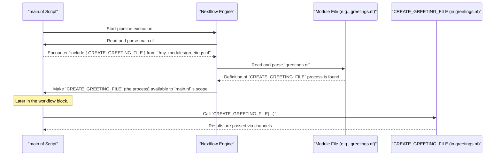

# Chapter 6: Module System

Welcome back! In [Chapter 5: Process](05_process_.md), we learned how to create individual "specialists" – our `process` definitions – that perform specific tasks in our Nextflow pipeline. We saw how a process like `fastqc` can run a tool to check the quality of our sequence reads.

Now, imagine you've built a fantastic `fastqc` process. It's perfectly tuned, uses the right container, and you're really proud of it. What if you want to use this exact same `fastqc` specialist in another Nextflow project? Or what if your current pipeline becomes very large, with dozens of processes, and your `main.nf` file starts to look like an overwhelmingly long scroll?

Copy-pasting process definitions into different files or different parts of a large file is a recipe for headaches. If you find a bug or want to improve the process, you'd have to change it in many places! There must be a better way to organize and reuse our code.

This is where Nextflow's **Module System** comes to the rescue!

## What are Modules? Your Reusable LEGO Blocks

Think of your Nextflow pipeline as a big, complex LEGO model. Each [Process](05_process_.md) is like a basic LEGO brick. As your model grows, just having a huge pile of individual bricks becomes messy.

**Modules** in Nextflow are like having pre-built LEGO components. A module is a self-contained, reusable piece of Nextflow code. Typically, it defines one or more [Process](05_process_.md)es, or sometimes even smaller, focused workflows.

Using modules helps you:
*   **Organize**: Break down your complex pipeline into smaller, manageable, and logical pieces.
*   **Reuse**: Easily use the same process or set of processes in different parts of your pipeline, or even in entirely different Nextflow projects, without copy-pasting.
*   **Share**: Share your well-crafted modules with colleagues or the wider Nextflow community.

It's like having a box of special, pre-assembled LEGO blocks (e.g., a "wheel assembly" or a "cockpit unit") that you can simply snap into your larger LEGO creation whenever you need them.

## Creating Your First Module: The "Greeting Card" Specialist

Let's say we have a simple process that creates a greeting file. We used something similar in the previous chapter.

```groovy
// Imagine this was in your main.nf
process CREATE_GREETING_FILE {
    input:
    val person_name

    output:
    path "${person_name}_greeting.txt"

    script:
    """
    echo "Hello, ${person_name}! Welcome to Nextflow modules!" > "${person_name}_greeting.txt"
    """
}
```
This is a nice little specialist. If we want to use it in other pipelines, or just keep our `main.nf` tidy, we can turn it into a module.

**Step 1: Create a Module File**
A module is simply a Nextflow script file (ending in `.nf`) that contains the process definition(s). Let's create a directory called `my_modules` and put a file named `greetings.nf` inside it.

```
my_pipeline/
├── main.nf
└── my_modules/
    └── greetings.nf
```

Now, put the process definition into `my_modules/greetings.nf`:

```groovy
// File: my_modules/greetings.nf
nextflow.enable.dsl=2 // Good practice!

process CREATE_GREETING_FILE {
    input:
    val person_name

    output:
    path "${person_name}_greeting.txt"

    script:
    """
    echo "Hello, ${person_name}! Welcome to Nextflow modules!" > "${person_name}_greeting.txt"
    """
}
```
That's it! `greetings.nf` is now a module that provides the `CREATE_GREETING_FILE` process.

**Step 2: Using the Module in `main.nf` with `include`**
To use the `CREATE_GREETING_FILE` process from our module in `main.nf`, we need to "import" it. This is done using the `include` keyword.

Modify your `main.nf` like this:

```groovy
// File: main.nf
nextflow.enable.dsl=2

// Import the process from our module
include { CREATE_GREETING_FILE } from './my_modules/greetings.nf'

workflow {
    names_ch = Channel.of("Alice", "Bob")

    // Now we can use the imported process!
    CREATE_GREETING_FILE(names_ch)

    CREATE_GREETING_FILE.out.view { file -> "Module created: $file" }
}
```
**Explanation:**
*   `include { CREATE_GREETING_FILE } from './my_modules/greetings.nf'`:
    *   `include { ... }`: This is the keyword to start importing.
    *   `CREATE_GREETING_FILE`: Inside the curly braces, you list the names of the processes (or workflows) you want to import from the module file.
    *   `from './my_modules/greetings.nf'`: This specifies the path to the module file. The path is relative to the location of the `main.nf` script.

Now, when you run `main.nf`:
1.  Nextflow sees the `include` statement.
2.  It reads `my_modules/greetings.nf` and makes the `CREATE_GREETING_FILE` process available to `main.nf`.
3.  The workflow then calls `CREATE_GREETING_FILE` as if it were defined directly in `main.nf`.
4.  It will create `Alice_greeting.txt` and `Bob_greeting.txt`.
You'll see output like:
```
Module created: Alice_greeting.txt
Module created: Bob_greeting.txt
```
You've successfully created and used your first module! It's like taking your "greeting card specialist" LEGO block from its own box (`greetings.nf`) and snapping it into your main LEGO construction (`main.nf`).

## Module Paths and Organization

Typically, Nextflow projects organize modules into a dedicated directory, often named `modules/` at the root of the project. Within this `modules/` directory, you can further organize modules into subdirectories based on functionality (e.g., `modules/fastq/`, `modules/alignment/`, `modules/qc/`).

Our tutorial project follows this convention:
```
your_nextflow_project/
├── main.nf
├── nextflow.config
├── modules/
│   ├── fastq/
│   │   ├── generate.nf     // Module for generating FASTQ
│   │   └── workflow.nf     // Might contain a workflow using FASTQ processes
│   ├── fastp/
│   │   └── trim.nf         // Module for trimming with fastp
│   └── fastqc/
│       ├── run.nf          // Module defining the fastqc process
│       └── workflow.nf     // Module defining a workflow for running fastqc
└── functions.nf
```
When you `include` a module, the path you provide in the `from` part is relative to the file doing the including.

## Aliasing: Giving Modules a Nickname with `as`

Sometimes, you might import a module whose process name is very generic, or you might want to import the *same module multiple times* but use it for slightly different purposes or with different configurations. In such cases, you can give the imported component a new name (an alias) using the `as` keyword.

Let's say our `greetings.nf` module also had a generic process called `LOG_MESSAGE`.
```groovy
// File: my_modules/greetings.nf (updated)
nextflow.enable.dsl=2

process CREATE_GREETING_FILE { /* ... as before ... */ }

process LOG_MESSAGE {
    input:
    val message
    script:
    """
    echo "LOG: $message"
    """
}
```

Now, in `main.nf`, we can import `LOG_MESSAGE` and give it a more specific name for its use:
```groovy
// File: main.nf
nextflow.enable.dsl=2

include { CREATE_GREETING_FILE; LOG_MESSAGE as INFO_LOGGER } from './my_modules/greetings.nf'

workflow {
    names_ch = Channel.of("Alice")
    CREATE_GREETING_FILE(names_ch)
    CREATE_GREETING_FILE.out.view()

    // Use the aliased process
    message_ch = Channel.of("Workflow started", "Workflow ended")
    INFO_LOGGER(message_ch) // This calls the original LOG_MESSAGE process
}
```
Here, `LOG_MESSAGE as INFO_LOGGER` means that within `main.nf`, the `LOG_MESSAGE` process from the module will be known as `INFO_LOGGER`. This is incredibly helpful for clarity and for reusing modules.

In our tutorial project's `main.nf`, you see this aliasing technique:
```groovy
// File: main.nf (snippet)
include { fastqc_wf as fastqc_raw_wf; fastqc_wf as fastqc_trimmed_wf } from './modules/fastqc/workflow.nf'
```
This line imports a workflow named `fastqc_wf` from `./modules/fastqc/workflow.nf` *twice*:
1.  Once as `fastqc_raw_wf` (presumably to run FastQC on raw reads).
2.  Once as `fastqc_trimmed_wf` (presumably to run FastQC on trimmed reads).

It's the *same* underlying module (the same LEGO component design) but used with different names for different stages of the analysis.

## How `include` Works: A Peek Under the Hood

When Nextflow encounters an `include` statement, it essentially performs these steps:
1.  **Locate**: It finds the module file specified in the `from` path.
2.  **Parse**: It reads and understands the Nextflow code within that module file, identifying the processes and workflows defined there.
3.  **Import**: For each component listed in the `include { ... }` block (like `CREATE_GREETING_FILE` or `LOG_MESSAGE`), Nextflow makes that component available in the scope of the current script (`main.nf` in our example). If an alias (`as ...`) is used, the component is made available under that alias.
4.  **Availability**: After the `include` line, you can call the imported processes or workflows as if they were written directly in your `main.nf` file.

Here's a simplified diagram:


The module system doesn't magically change how processes run; it's primarily a way to organize and make your code definitions portable and reusable.

## Modules in Our Project

Our tutorial project heavily uses modules to keep the `main.nf` file focused on the overall workflow logic, while the details of each specific task are encapsulated in module files.

Let's look at one example from our project's `main.nf`:
```groovy
// File: main.nf (snippet)
include { generate_fastq } from './modules/fastq/generate.nf'
```
This line tells Nextflow:
*   "Look for a file named `generate.nf` inside a directory named `fastq`, which itself is inside a directory named `modules`."
*   "From that file, I want to import a component named `generate_fastq`."

The `modules/fastq/generate.nf` file contains the `process generate_fastq { ... }` definition:
```groovy
// File: modules/fastq/generate.nf (simplified)
nextflow.enable.dsl=2

process generate_fastq {
    output:
    tuple val("synthetic"), path("synthetic_R1.fastq"), path("synthetic_R2.fastq", optional: true)

    script:
    // Command to generate FASTQ files, uses params.paired_end, params.num_reads
    """
    echo "Generating R1..." > synthetic_R1.fastq
    if ( ${params.paired_end} ) {
      echo "Generating R2..." > synthetic_R2.fastq
    } else {
      touch synthetic_R2.fastq // Create empty R2 placeholder
    }
    """
}
```
Once included, the `main.nf` workflow can then simply call `generate_fastq()`:
```groovy
// File: main.nf (workflow snippet)
workflow {
    if (params.generate_reads) {
        generate_fastq() // This uses the imported process
        input_channel = generate_fastq.out
    }
    // ...
}
```
This makes the `main.nf` much cleaner. Instead of having the full `process generate_fastq` definition cluttering the main workflow logic, we just have a simple `include` statement and then we use the imported "LEGO block."

**A Note on `params` and Modules:**
Pipeline [Parameters (`params`)](02_parameters___params___.md) are generally global. This means a process defined within a module (like `generate_fastq` using `params.paired_end` and `params.num_reads`) can access parameters defined in your `nextflow.config` or passed via the command line, just as if it were defined directly in `main.nf`. Modules themselves don't typically define new `params`; they consume the existing ones.

## What We've Learned

The Module System is a powerful feature for creating well-organized, reusable, and shareable Nextflow pipelines.
*   **Modules** are self-contained `.nf` files that typically define one or more [Process](05_process_.md)es or small workflows (like pre-built LEGO blocks).
*   You use the `include { COMPONENT_NAME } from './path/to/module.nf'` syntax to import components from a module file into your script.
*   You can use `as` to **alias** imported components, giving them different names in your script (e.g., `include { MY_PROCESS as MY_SPECIFIC_TASK } from ...`).
*   Modules help keep your main workflow file clean and focused on the overall logic.
*   A common practice is to organize modules in a top-level `modules/` directory.

## Next Steps

We've seen that modules can contain not only individual [Process](05_process_.md)es but also "smaller, focused workflows." In our project, `fastqc_wf` was an example of a workflow imported from a module. What exactly is a workflow defined within another workflow or module called? And how do they help in structuring even larger pipelines?

That's precisely what we'll explore in the next chapter: [Sub-workflow (`process_reads`)](07_sub_workflow___process_reads___.md).

---

Generated by [AI Codebase Knowledge Builder](https://github.com/The-Pocket/Tutorial-Codebase-Knowledge)