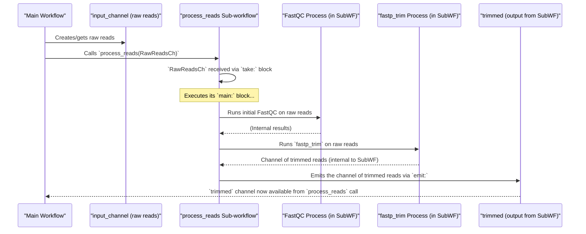

# Chapter 7: Sub-workflow (`process_reads`)

Welcome back! In [Chapter 6: Module System](06_module_system_.md), we learned how to organize our individual [Process](05_process_.md) definitions into reusable "LEGO blocks" called modules. This helps keep our `main.nf` file tidy and allows us to share these blocks.

But what if you have a sequence of several LEGO blocks (processes and channel operations) that you always use together to achieve a common, multi-step task? For example, in bioinformatics, it's very common to:
1.  Check the quality of raw sequencing reads.
2.  Trim away bad quality parts or adapter sequences.
3.  Check the quality of the trimmed reads to see if the trimming helped.

You might need to perform this exact sequence of operations whether your reads were freshly generated or if you're using existing read files. Repeating these three steps in different parts of your workflow, or in different entry points, would be repetitive and error-prone.

This is where **Sub-workflows** come in handy! They let you bundle a sequence of operations into a reusable "mini-recipe."

## What is a Sub-workflow? Your Mini-Recipe

A **sub-workflow** is a named sequence of workflow steps (like calling [Process](05_process_.md)es or manipulating [Channel](04_channel_.md)s) that is defined within your Nextflow script (often in `main.nf` or a module file) and can be called just like a function.

Think of it like this:
*   Your main `workflow` in `main.nf` is your master cookbook.
*   A `process` is a single, very specific instruction in a recipe (e.g., "chop onions").
*   A **sub-workflow** is like a smaller, self-contained recipe within your cookbook for a common preparation, like "How to Make a Basic Tomato Sauce." You can then refer to this "Basic Tomato Sauce" mini-recipe in many different main dishes (your main workflows or other sub-workflows).

In our project, the `process_reads` sub-workflow is exactly this: a mini-recipe that handles the common steps of read counting, quality control, and trimming.

Using sub-workflows helps to:
*   **Promote code reuse**: Define a common sequence of tasks once and use it multiple times.
*   **Make the main workflow cleaner**: The main workflow can call the sub-workflow with a single line, hiding the complexity of the individual steps.
*   **Improve organization**: Break down large pipelines into more manageable, logical chunks.

## Defining a Sub-workflow: The Mini-Recipe Structure

Defining a sub-workflow is very similar to defining the main `workflow`, but you give it a name. It has a specific structure:

```groovy
// Syntax for defining a sub-workflow
workflow MY_SUB_WORKFLOW_NAME {
    take: // Inputs
        input_channel_for_subworkflow

    main: // The steps of the sub-workflow
        // ... call processes, operate on channels ...
        STEP_1(input_channel_for_subworkflow)
        STEP_2_RESULT_CHANNEL = STEP_2(STEP_1.out)
        // ... more steps ...

    emit: // Outputs
        result_channel_from_subworkflow = STEP_2_RESULT_CHANNEL
        // you can emit multiple named channels
}
```
Let's break this down:
*   `workflow MY_SUB_WORKFLOW_NAME { ... }`: This declares a sub-workflow with a specific name.
*   **`take:` block**: This is where you declare the input [Channel](04_channel_.md)(s) that this sub-workflow expects to receive when it's called. Think of these as the ingredients for your mini-recipe.
*   **`main:` block**: This is the heart of the sub-workflow. It contains the sequence of operations – calling [Process](05_process_.md)es, using channel operators, or even calling other sub-workflows. This is where the "cooking" happens.
*   **`emit:` block**: This is where you declare the output [Channel](04_channel_.md)(s) that the sub-workflow will produce and make available to the workflow that called it. These are the finished dishes from your mini-recipe.

## Our Project's Star: The `process_reads` Sub-workflow

In our project's `main.nf` file, there's a sub-workflow named `process_reads`. Its job is to take input sequencing reads and perform a standard set of processing steps: preliminary read counting, quality control with FastQC, trimming with fastp, and then final read counting and FastQC on the trimmed reads.

Let's look at a simplified conceptual version of its definition first:
```groovy
// File: main.nf (Conceptual, simplified 'process_reads')
workflow process_reads {
    take:
        raw_reads_channel // Expects a channel of raw reads

    main:
        // Step 1: Perform initial Quality Control on raw reads
        FASTQC_RAW(raw_reads_channel)

        // Step 2: Trim the raw reads
        TRIM_READS(raw_reads_channel)
        trimmed_reads_channel = TRIM_READS.out

        // Step 3: Perform Quality Control on trimmed reads
        FASTQC_TRIMMED(trimmed_reads_channel)

    emit:
        processed_reads = trimmed_reads_channel // Output the trimmed reads
}
```
**Explanation:**
*   `workflow process_reads { ... }`: Defines our sub-workflow.
*   `take: raw_reads_channel`: It declares that it needs one input channel, which we've named `raw_reads_channel` here. This channel will carry the raw sequence reads.
*   `main:`:
    *   `FASTQC_RAW(raw_reads_channel)`: It calls a hypothetical `FASTQC_RAW` process (or module) using the input reads.
    *   `TRIM_READS(raw_reads_channel)`: It calls a `TRIM_READS` process, also using the raw reads.
    *   `trimmed_reads_channel = TRIM_READS.out`: It captures the output channel from `TRIM_READS` (containing the trimmed reads) into a new channel variable.
    *   `FASTQC_TRIMMED(trimmed_reads_channel)`: It calls another QC process on the `trimmed_reads_channel`.
*   `emit: processed_reads = trimmed_reads_channel`: It declares an output channel named `processed_reads`. The data for this channel comes from `trimmed_reads_channel`.

This `process_reads` sub-workflow now encapsulates this entire sequence of QC-Trim-QC.

## Calling a Sub-workflow: Using Your Mini-Recipe

Once defined, you can call a sub-workflow from your main workflow (or even another sub-workflow) by its name, passing the required input channels as arguments.

In our project's `main.nf`, the main workflow calls `process_reads` like this:

```groovy
// File: main.nf (main workflow snippet)
workflow {
    // ... (logic to create 'input_channel' for reads) ...
    if (params.generate_reads) {
        generate_fastq()
        input_channel = generate_fastq.out
    } else {
        // ... logic for existing reads to create input_channel ...
        input_channel = Channel.fromFilePairs(params.reads, size: 2)
                             .map { id, files -> tuple(id, files[0], files[1]) }
    }

    // Now, call the sub-workflow
    process_reads(input_channel) // Pass the reads to the mini-recipe
}
```
**Explanation:**
*   First, the `input_channel` is prepared, either from generated reads or existing files (as we saw in [Chapter 1: Workflow Definition](01_workflow_definition_.md)).
*   `process_reads(input_channel)`: This single line executes the entire sequence of steps defined within the `process_reads` sub-workflow, using the data from `input_channel`.

If you want to use the outputs of a sub-workflow, you can assign the call to a variable. The variable will then hold the channels emitted by the sub-workflow.
```groovy
// Get results from the sub-workflow
results_from_sub = process_reads(input_channel)

// Access the emitted channel named 'processed_reads' (or 'trimmed' in our project)
results_from_sub.processed_reads.view { file -> "Trimmed file: $file" }
```
In our project, the `process_reads` sub-workflow emits a channel named `trimmed`. So, it would be:
```groovy
all_processed = process_reads(input_channel)
all_processed.trimmed.view() // View the trimmed reads output by the sub-workflow
```

## How Sub-workflows Work: A Peek Under the Hood

When your main workflow calls a sub-workflow:
1.  **Input Channel Passed**: The input channel(s) you provide in the call (e.g., `input_channel` in `process_reads(input_channel)`) are passed to the sub-workflow.
2.  **`take` Receives**: The sub-workflow's `take:` block receives these incoming channels. The names used in the `take:` block become local channel variables within the sub-workflow.
3.  **`main` Executes**: The operations defined in the sub-workflow's `main:` block are then executed, using the channels received via `take`. This can involve running [Process](05_process_.md)es, manipulating channels, etc.
4.  **`emit` Prepares Output**: As the `main:` block completes, any channels assigned in the `emit:` block are prepared as the sub-workflow's outputs.
5.  **Outputs Returned**: These emitted channels are then returned to the calling workflow. If the sub-workflow call was assigned to a variable (e.g., `results = process_reads(...)`), that variable now provides access to these emitted channels (e.g., `results.trimmed`).

Here's a simplified diagram:



## The Actual `process_reads` in Our Project

The `process_reads` sub-workflow in our project's `main.nf` is a bit more detailed than the conceptual version. It also includes steps for counting reads using a custom function (defined in `functions.nf` and imported, a concept beyond this chapter's scope but good to notice).

```groovy
// File: main.nf (actual 'process_reads' sub-workflow)
workflow process_reads {
    take:
        input_channel  // Input channel of reads (id, read1, read2)
    
    main:
        // Count reads in input files (simplified view of this part)
        // input_channel.subscribe { ... countReadsInFastq(...) ... }
        println "[INFO] process_reads: Starting initial read counting and FastQC..."
        
        // Convert input for FastQC if needed (id, read1), (id, read2)
        input_reads_for_fastqc = input_channel.flatMap { id, r1, r2 -> 
                                   r2 ? [ [id, r1], [id, r2] ] : [ [id, r1] ] 
                                 }
        // Call FastQC module on raw reads
        fastqc_raw_wf("${params.outdir}/fastqc_raw", input_reads_for_fastqc)
        
        println "[INFO] process_reads: Starting trimming..."
        // Call trimming module
        trimming_results = fastp_trim(input_channel) // fastp_trim is an imported process
        
        // Count reads in trimmed files (simplified view)
        // trimming_results.subscribe { ... countReadsInFastq(...) ... }
        println "[INFO] process_reads: Starting FastQC on trimmed reads..."
        
        // Convert trimmed output for FastQC
        trimmed_reads_for_fastqc = trimming_results.flatMap { id, tr1, tr2 -> 
                                     tr2 ? [ [id, tr1], [id, tr2] ] : [ [id, tr1] ] 
                                   }
        // Call FastQC module on trimmed reads
        fastqc_trimmed_wf("${params.outdir}/fastqc_trimmed", trimmed_reads_for_fastqc)
    
    emit:
        trimmed = trimming_results // Emit the channel from fastp_trim
}
```
**Breakdown of the project's `process_reads`:**
*   `take: input_channel`: It expects a channel typically carrying tuples like `(sample_id, read1_path, read2_path)`.
*   `main:`:
    *   It uses `.flatMap` to prepare the `input_channel` for the `fastqc_raw_wf` module. The `fastqc_wf` module (aliased as `fastqc_raw_wf`) expects individual reads. `flatMap` transforms `(id, r1, r2)` into two items `(id, r1)` and `(id, r2)` if `r2` exists.
    *   `fastqc_raw_wf(...)`: Calls the FastQC workflow module (imported from `./modules/fastqc/workflow.nf` and aliased) for raw reads.
    *   `trimming_results = fastp_trim(input_channel)`: Calls the `fastp_trim` process (imported from `./modules/fastp/trim.nf`) to perform read trimming. The output channel of `fastp_trim` is stored in `trimming_results`.
    *   It then uses `.flatMap` again on `trimming_results` to prepare them for `fastqc_trimmed_wf`.
    *   `fastqc_trimmed_wf(...)`: Calls the FastQC workflow module again (this time aliased as `fastqc_trimmed_wf`) for the trimmed reads.
    *   (The actual read counting lines using `subscribe` and `countReadsInFastq` are present in the full code, adding more functionality).
*   `emit: trimmed = trimming_results`: It makes the channel containing the trimmed reads (which came from the `fastp_trim` process) available as an output of the `process_reads` sub-workflow. This output channel will be named `trimmed`.

## Benefits in Our Project

The `process_reads` sub-workflow is incredibly useful in our project:
1.  **Main Workflow**: The main (default) workflow in `main.nf` calls `process_reads` after it has either generated new reads or prepared a channel from existing reads.
    ```groovy
    // File: main.nf (main workflow snippet)
    workflow {
        // ... logic to set up 'input_channel' ...
        process_reads(input_channel) // One call handles all processing
    }
    ```
2.  **Named Entry Point Workflows**: The project also defines other named workflows like `generate_single_end`, `generate_paired_end`, `existing_single_end`, and `existing_paired_end`. These are often used for specific test cases or alternative ways to run the pipeline. *All of them also call `process_reads`!*
    ```groovy
    // File: main.nf (example: generate_single_end workflow)
    workflow generate_single_end {
        // ... specific setup for single-end generation ...
        generate_fastq()
        input_channel = generate_fastq.out
        
        // Process the data using the SAME shared sub-workflow
        process_reads(input_channel)
    }
    ```
Without the `process_reads` sub-workflow, the sequence of FastQC, trimming, and FastQC again would have to be repeated in the main workflow *and* in each of the four named entry point workflows. That's a lot of duplicated code! The sub-workflow keeps our pipeline DRY (Don't Repeat Yourself).

## What We've Learned

Sub-workflows are a powerful way to structure complex Nextflow pipelines and promote reusability.
*   A **sub-workflow** is a named sequence of workflow logic (processes, channel operations) that can be called like a function.
*   It's defined using `workflow SUB_NAME { ... }` and includes `take:` (for inputs), `main:` (for logic), and `emit:` (for outputs) blocks.
*   They help **encapsulate common patterns of operations**, like our `process_reads` sub-workflow which bundles read counting, QC, and trimming.
*   Calling a sub-workflow (e.g., `process_reads(my_input_reads)`) makes your main workflow cleaner and easier to understand.
*   They are key to **avoiding code duplication** when the same sequence of steps is needed in multiple places.

This chapter concludes our core concept tour for this Nextflow project! You've learned about the [Workflow Definition](01_workflow_definition_.md), [Parameters (`params`)](02_parameters___params___.md), [Pipeline Configuration (`nextflow.config`)](03_pipeline_configuration___nextflow_config___.md), [Channel](04_channel_.md)s, [Process](05_process_.md)es, the [Module System](06_module_system_.md), and now Sub-workflows. With these building blocks, you're well on your way to understanding and building your own Nextflow pipelines.

Happy pipelining!

---

Generated by [AI Codebase Knowledge Builder](https://github.com/The-Pocket/Tutorial-Codebase-Knowledge)