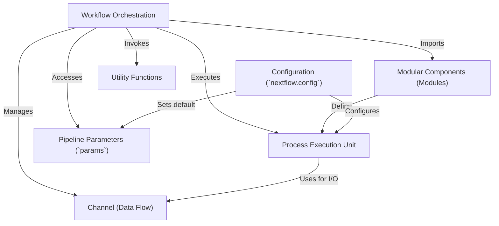

# Tutorial: nextflow

This project showcases a **Nextflow pipeline** designed for processing *sequencing data*. It can either *generate synthetic reads* or work with *existing FASTQ files*. The pipeline performs common bioinformatics tasks like *quality control* using FastQC and *read trimming* using fastp. It demonstrates how to build **modular** and **configurable** workflows in Nextflow, emphasizing the flow of data through *channels* between different *processing steps*.

**Source Repository:** [None](None)

## Chapters

1. [Workflow Orchestration
](01_workflow_orchestration_.md)
2. [Pipeline Parameters (`params`)
](02_pipeline_parameters___params___.md)
3. [Channel (Data Flow)
](03_channel__data_flow__.md)
4. [Process Execution Unit
](04_process_execution_unit_.md)
5. [Configuration (`nextflow.config`)
](05_configuration___nextflow_config___.md)
6. [Modular Components (Modules)
](06_modular_components__modules__.md)
7. [Utility Functions
](07_utility_functions_.md)

---

Generated by [AI Codebase Knowledge Builder](https://github.com/The-Pocket/Tutorial-Codebase-Knowledge)