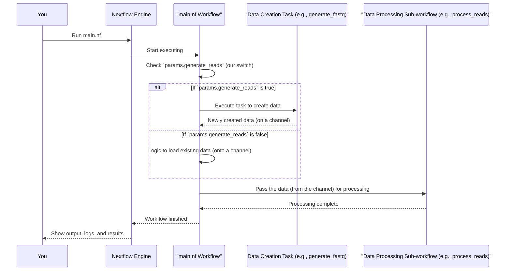

# Chapter 1: Workflow Definition

Welcome to your Nextflow journey! Imagine you're about to cook a delicious, but rather complex, multi-course meal. You wouldn't just start throwing ingredients together, would you? You'd need a master recipe – something that tells you all the steps, what ingredients to use for each, and the order to do things.

In the world of data analysis, especially when dealing with many steps and large datasets, things can get complicated quickly. How do you keep track of all the analysis stages? How do you ensure they run in the correct order? And how do you make sure your analysis can be run again by you or someone else with the same results?

This is where Nextflow comes in. Nextflow helps you write that "master recipe" for your data analysis. And the core of this recipe is called the **Workflow Definition**.

Think of the Workflow Definition as the main script or blueprint that outlines your entire data analysis pipeline. It defines:
*   The sequence of tasks (the individual cooking steps).
*   How data flows between these tasks (passing ingredients from one step to the next).
*   Any conditional logic (e.g., "if the chicken is frozen, thaw it first").

## Your First Look: The `main.nf` File

This master recipe usually lives in a special file, typically named `main.nf`. When you tell Nextflow to run your project, this `main.nf` file is the first place it looks for instructions. It's the starting point for your entire analysis.

Inside `main.nf`, you'll find instructions written in a language that Nextflow understands (which is based on Groovy, but don't worry, Nextflow adds its own magic to make pipeline creation easier!).

## The `workflow` Block: The Heart of the Recipe

The most important part of your `main.nf` file, where you define the main sequence of your analysis, is called the `workflow` block. It looks like this:

```groovy
// File: main.nf
workflow {
    // Your analysis steps go here!
}
```

If `main.nf` is your cookbook, this `workflow { ... }` section is the main recipe you want Nextflow to follow.

Let's try the simplest possible workflow. If your `main.nf` file contained just this:

```groovy
// File: main.nf
#!/usr/bin/env nextflow
nextflow.enable.dsl=2 // A special setting for modern Nextflow, good to include!

workflow {
    println "My first Nextflow step!"
}
```
And you ran it (we'll cover *how* to run Nextflow later), it would simply print the message "My first Nextflow step!" to your screen. This workflow has just one step: printing a message.

## A Slightly More Complex Recipe: Our Project's `main.nf`

Our example project (the one these tutorial chapters are based on) has a `main.nf` file that describes a more interesting bioinformatics analysis. It's like a recipe that has a choice at the beginning: "Do we need to prepare our main ingredient (sequence reads) from scratch, or do we have some ready to use?"

The main workflow in our project's `main.nf` essentially does two major things:
1.  **Gets the input data:** It decides whether to generate new, synthetic sequence reads (our data "ingredient") or use existing read files you provide.
2.  **Processes the data:** Once it has the reads, it passes them to another set of steps for common processing tasks like quality control and trimming.

## Looking Closer at Our `main.nf` Workflow

Let's peek at a simplified version of the main `workflow` block from our project's `main.nf` file. Don't worry about understanding every single detail yet; we're focusing on the overall structure.

```groovy
// File: main.nf (simplified snippet of the main workflow)

workflow {
    // Choose input: generate synthetic reads or use provided ones
    if (params.generate_reads) {
        generate_fastq()              // Step 1a: If we need to make data
        input_channel = generate_fastq.out // Get the data we just made
    } else {
        // Step 1b: If we are using existing data files
        // (Code to load existing files would be here)
        // For example:
        // input_channel = Channel.fromFilePairs(params.reads, size: 2) 
        //                 .map { id, files -> tuple(id, files[0], files[1]) }
        println "Using existing reads (details hidden for now)."
    }

    // Step 2: Process the data using the shared sub-workflow
    process_reads(input_channel)      // Pass the data to another recipe
}
```

Let's break this down:

*   **`if (params.generate_reads)`**: This is a decision point!
    *   `params.generate_reads` is like a switch. If it's "on" (true), Nextflow does one thing. If it's "off" (false), it does another.
    *   Think of it as asking: "Should we generate new reads?"
    *   We'll learn all about these `params` (parameters) in the next chapter, [Parameters (`params`)](02_parameters___params___.md). For now, just know they help our workflow make choices.

*   **`generate_fastq()`**:
    *   If `params.generate_reads` is true, this line is executed.
    *   `generate_fastq` is a "task" or, more specifically in Nextflow terms, a [Process](05_process_.md).
    *   Think of it as calling a helper function or a mini-recipe that knows exactly how to create (generate) new FASTQ files (a common format for sequence reads).
    *   We'll explore [Process](05_process_.md)es in detail in a later chapter.

*   **`input_channel = generate_fastq.out`**:
    *   Data in Nextflow often flows through things called **channels**. Imagine a channel as a conveyor belt carrying items (data) from one workstation (task) to another.
    *   `generate_fastq.out` refers to the "output conveyor belt" from our `generate_fastq` task. It's where the newly created FASTQ files are placed.
    *   We then store this conveyor belt in a variable called `input_channel` so we can use its contents later.
    *   We'll dedicate a whole chapter to understanding [Channel](04_channel_.md)s soon!

*   **`else { ... }`**:
    *   If `params.generate_reads` is false, the code inside the `else` block runs. This part of the workflow would be responsible for finding and preparing your *existing* read files.
    *   The actual code for creating a channel from existing files (like `Channel.fromFilePairs(...)`) is a bit more complex, so we've simplified it here. The key idea is that `input_channel` will end up holding the data, whether it was generated or came from existing files.

*   **`process_reads(input_channel)`**:
    *   This is the second main step of our workflow.
    *   `process_reads` is actually another, more complex recipe-within-a-recipe, called a [Sub-workflow (`process_reads`)](07_sub_workflow___process_reads___.md). It groups several common processing steps together.
    *   We're telling Nextflow: "Take the data that's on the `input_channel` conveyor belt (whether it was just generated or loaded from files) and send it to the `process_reads` sub-workflow for further analysis."
    *   We'll learn about [Sub-workflow (`process_reads`)](07_sub_workflow___process_reads___.md) later.

## The Workflow as an Orchestrator

Notice how the main `workflow` block in `main.nf` doesn't actually perform the nitty-gritty details of generating files or trimming them itself. Instead, it *orchestrates* these tasks. It calls other specialized tools ([Process](05_process_.md)es like `generate_fastq`) or collections of tools ([Sub-workflow (`process_reads`)](07_sub_workflow___process_reads___.md)s) to do the work.

It's like a movie director: the director doesn't usually operate the camera, apply makeup, or build the sets. Instead, they coordinate all the specialists to create the final movie. Our main workflow in `main.nf` orchestrates the entire analysis, choosing between generating reads or using existing ones, and then passing them to the `process_reads` sub-workflow.

## How Nextflow Runs Your Workflow (A Simple View)

When you eventually tell Nextflow to run your pipeline (e.g., by typing `nextflow run main.nf` in your terminal):

1.  Nextflow reads your `main.nf` file.
2.  It finds the main `workflow` block (the one without a specific name, or one explicitly named `main`).
3.  It starts executing the steps defined inside that block, following the logic you've written (like the `if/else` condition). It figures out the order and can even run independent tasks in parallel to save time!

Here's a simplified diagram of what happens:



## Other Workflows in `main.nf` (A Sneak Peek)

If you look at the complete `main.nf` file for our project, you'll notice there are *other* `workflow` blocks, like `workflow generate_single_end { ... }` and `workflow existing_paired_end { ... }`.

These are like alternative recipes in your cookbook. The `workflow { ... }` block that doesn't have a specific name (or is explicitly named `workflow main { ... }`) is the default one Nextflow runs if you don't specify otherwise. The named workflows can be run explicitly (e.g., `nextflow run main.nf -entry generate_single_end`) and are often used for different modes of operation or for testing specific parts of your pipeline. We won't focus on these named workflows for now, but it's good to know they can exist.

For this tutorial, when we talk about "the workflow definition," we're primarily referring to that main, default `workflow` block in `main.nf`.

## What We've Learned

Phew! That was a lot, but you've just understood the most fundamental concept in Nextflow:

*   The **Workflow Definition** is your primary script (usually `main.nf`) that outlines your entire data analysis pipeline.
*   The `workflow { ... }` block within this script is where you define the sequence of tasks, how data flows, and any conditional logic.
*   This main workflow acts as an **orchestrator**, calling upon specialized [Process](05_process_.md)es and [Sub-workflow (`process_reads`)](07_sub_workflow___process_reads___.md)s to get the job done.

## Next Steps

In our main workflow example, we saw a decision being made based on `params.generate_reads`. But what are these `params`, and how do we control them? That's exactly what we'll explore in the next chapter!

Get ready to learn how to make your workflows flexible and configurable with [Parameters (`params`)](02_parameters___params___.md).

---

Generated by [AI Codebase Knowledge Builder](https://github.com/The-Pocket/Tutorial-Codebase-Knowledge)