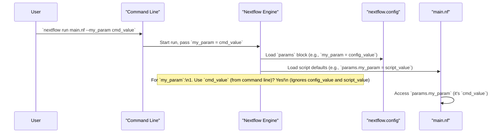

# Chapter 2: Parameters (`params`)

Welcome back! In [Chapter 1: Workflow Definition](01_workflow_definition_.md), we saw how our `main.nf` file acts as a master recipe for our data analysis. We even got a glimpse of a decision-making step that used something called `params.generate_reads`. It was like a switch in our recipe: "Should we make new ingredients or use existing ones?"

But how does this "switch" get its setting? And can we change it without rewriting our recipe each time? This is where **Parameters** come in!

## Why Do We Need Parameters? The "Dials and Knobs" of Your Workflow

Imagine you have a fantastic music player. You can play any song you want (your data), and it has various options: volume, bass, treble, shuffle mode, etc. These options let you customize your listening experience without needing to open up the music player and rewire its circuits.

**Parameters (`params`) in Nextflow are exactly like these dials and knobs for your workflow.**

They allow you to:
*   Tell your workflow where to find input files (e.g., `params.reads = "path/to/my/data/"`).
*   Adjust settings for tools used in your workflow (e.g., `params.quality_threshold = 30`).
*   Turn features on or off (like our `params.generate_reads` switch).

The best part? You can change these settings *without modifying the workflow script (`main.nf`)* itself. This makes your workflow incredibly flexible and easy for others (or your future self) to use with different data or slightly different goals.

## Accessing Parameters in Your Workflow

Inside your workflow script (e.g., `main.nf`), you can access the value of any parameter using the `params` object followed by a dot and the parameter's name.

Let's look at the `if` condition from Chapter 1 again:

```groovy
// File: main.nf (snippet)
if (params.generate_reads) {
    // Code to generate reads
    println "The 'generate_reads' knob is ON. We'll make new data!"
} else {
    // Code to use existing reads
    println "The 'generate_reads' knob is OFF. We'll use existing data."
}
```
Here, `params.generate_reads` will either be `true` or `false`. The workflow then behaves differently based on this value.

## Setting Default Values for Parameters

If parameters are like dials, they need a starting position, right? These are their **default values**. There are a couple of common places to set these:

**1. Directly in your `main.nf` script:**
You can set default values for parameters at the very top of your `main.nf` file, even before the `workflow` block.

```groovy
// File: main.nf (at the top)
#!/usr/bin/env nextflow
nextflow.enable.dsl=2

params.generate_reads = true  // Default: YES, generate reads
params.output_folder = "my_results" // Default output folder name
params.greeting = "Hello"

workflow {
    if (params.generate_reads) {
        println "${params.greeting}! We are generating reads."
    } else {
        println "${params.greeting}! We are using existing reads."
    }
    println "Results will be in: ${params.output_folder}"
}
```
If you run this workflow as is, `params.generate_reads` will be `true`, `params.output_folder` will be `"my_results"`, and `params.greeting` will be `"Hello"`.

**2. In the `nextflow.config` file:**
A more common and organized way to set default parameters, especially for larger projects, is in a special file named `nextflow.config`. This file is like a central control panel for your workflow's settings.

Here's how you might define defaults in `nextflow.config`:
```groovy
// File: nextflow.config
params {
    generate_reads = true
    output_folder = "pipeline_results"
    greeting = "Welcome"
    num_reads = 1000 // Another example parameter
}
```
If this `nextflow.config` file exists in the same directory as your `main.nf`, Nextflow will automatically read it. We'll dive much deeper into what else you can do with this file in the next chapter, [Pipeline Configuration (`nextflow.config`)](03_pipeline_configuration___nextflow_config___.md). For now, just know it's a great place for default parameters.

**What if a parameter is defined in both `main.nf` and `nextflow.config`?**
The value in `nextflow.config` usually takes precedence over a default set at the top of `main.nf`. Think of `nextflow.config` as a more specific settings file.

## Changing Parameters Without Editing Code: The Command Line

This is where the real power and flexibility of parameters shine! You can easily change the value of any parameter when you *run* your workflow using command-line arguments. You don't need to open or edit any files.

To change a parameter, you add `--` (two hyphens) followed by the parameter name, then a space, and then its new value.

Let's use our simple `main.nf` example (assuming no `nextflow.config` for a moment, or that we want to override it):
```groovy
// File: main.nf
#!/usr/bin/env nextflow
nextflow.enable.dsl=2

params.generate_reads = true
params.greeting = "Hello"

workflow {
    if (params.generate_reads) {
        println "${params.greeting}! Generating reads."
    } else {
        println "${params.greeting}! Using existing reads from ${params.reads_path}." // Let's imagine we need a path
    }
}
```

**Scenario 1: Run with defaults**
Command: `nextflow run main.nf`
Output:
```
Hello! Generating reads.
```
(It would also complain `params.reads_path` is not defined if `generate_reads` was false, but we'll keep it simple).

**Scenario 2: Turn OFF read generation and specify a path**
Command: `nextflow run main.nf --generate_reads false --reads_path "data/my_samples/"`
Output:
```
Hello! Using existing reads from data/my_samples/.
```
Notice how we "flipped the switch" for `generate_reads` to `false` and provided a value for `params.reads_path` directly from the command line. The workflow behaved differently without any code changes!

**Scenario 3: Change the greeting**
Command: `nextflow run main.nf --greeting "Hi there"`
Output:
```
Hi there! Generating reads.
```

This ability to override parameters from the command line is extremely useful for:
*   Running the same workflow on different datasets.
*   Experimenting with different tool settings.
*   Automating runs in different configurations.

## How Nextflow Decides a Parameter's Value (Order of Precedence)

You might be wondering: what if a parameter is set in `main.nf`, in `nextflow.config`, AND on the command line? Which one wins? Nextflow has a clear order:

1.  **Command Line:** Values specified here (e.g., `--my_param value`) always have the highest priority. They override everything else.
2.  **`params` file (advanced):** You can specify a separate file with parameter definitions using `-params-file your_params.yml` (or `.json`). This overrides `nextflow.config`. (We won't focus on this for now, but it's good to know it exists).
3.  **`nextflow.config`:** Values set in the `params { ... }` block in `nextflow.config` come next.
4.  **Script Defaults:** Values set directly in your workflow script (e.g., `params.my_param = "default"` at the top of `main.nf`) have the lowest priority. They are used if the parameter isn't set anywhere else.

Here's a simplified view of how Nextflow figures out the value for a parameter:



If `--my_param cmd_value` was *not* provided on the command line, Nextflow would then check `nextflow.config`. If found there, that value would be used. If not in `nextflow.config` either, it would finally use the default set in `main.nf`.

## Parameters in Our Project

Let's look at how parameters are set up in our course project:

**In `main.nf` (top lines):**
```groovy
// File: main.nf (snippet)
params.reads = "data/reads/*_{1,2}.fastq"  // Default path for existing reads
params.paired_end = true                      // Default: reads are paired-end
params.outdir = "results"                     // Default output directory
params.generate_reads = true                // Default: generate new reads
// ... other params ...
```
These are the script's fallback default values.

**In `nextflow.config` (relevant part):**
```groovy
// File: nextflow.config (snippet)
params {
    // Number of reads to generate if params.generate_reads is true
    num_reads = 1000
    
    // Default publish directory (can be used by modules)
    publish_dir = null // Means not set by default, modules might set their own
}
```
Notice `num_reads` is defined here. If we run `nextflow run main.nf` and `params.generate_reads` is true (its default from `main.nf`), it will try to generate 1000 reads. If `params.generate_reads` was set to `true` in `nextflow.config` too, that would take precedence over the `main.nf` setting.

Now, if we run our project with a command like this:
`nextflow run main.nf --generate_reads false --reads "path/to/my/actual/data/*_{1,2}.fastq" --num_reads 5000`

*   `params.generate_reads` will be `false` (overriding the `main.nf` default).
*   `params.reads` will be `"path/to/my/actual/data/*_{1,2}.fastq"` (overriding the `main.nf` default).
*   `params.num_reads` will be `5000` (overriding the `nextflow.config` default).
*   `params.outdir` will still be `"results"` (from the `main.nf` default, as we didn't override it).

Our main workflow uses these:
```groovy
// File: main.nf (workflow snippet)
workflow {
    if (params.generate_reads) {
        generate_fastq() // This process might internally use params.num_reads
        // ...
    } else {
        // This part would use params.reads and params.paired_end
        input_channel = Channel.fromFilePairs(params.reads, size: 2) 
        // ...
    }
    // ...
    // Many processes might use params.outdir to know where to save results
}
```
So, by simply changing command-line arguments, we can tell our workflow to:
*   Generate 1000 reads (default behavior).
*   Generate 50,000 reads (`--num_reads 50000`).
*   Use existing paired-end reads from a specific folder (`--generate_reads false --reads "path/to/data/*_{1,2}.fastq"`).
*   Use existing single-end reads (`--generate_reads false --paired_end false --reads "path/to/single_reads/*.fastq"`).

All without touching the `main.nf` workflow logic itself!

## What We've Learned

Parameters (`params`) are a cornerstone of creating flexible and reusable Nextflow workflows.
*   They act as **configurable settings** or "dials and knobs" for your pipeline.
*   You access them within your workflow script using `params.your_parameter_name`.
*   **Default values** can be set in `main.nf` or, more commonly, in the `nextflow.config` file.
*   Most importantly, parameters can be easily **overridden from the command line** (`--param_name value`), allowing you to adapt the workflow's behavior without editing its code.
*   There's a clear **order of precedence**: Command Line > `nextflow.config` > Script Defaults.

## Next Steps

We've seen that `nextflow.config` is a key place for setting default parameters and other workflow configurations. In the next chapter, we'll explore this file in much more detail.

Get ready to learn about the central control panel for your pipeline: [Pipeline Configuration (`nextflow.config`)](03_pipeline_configuration___nextflow_config___.md).

---

Generated by [AI Codebase Knowledge Builder](https://github.com/The-Pocket/Tutorial-Codebase-Knowledge)