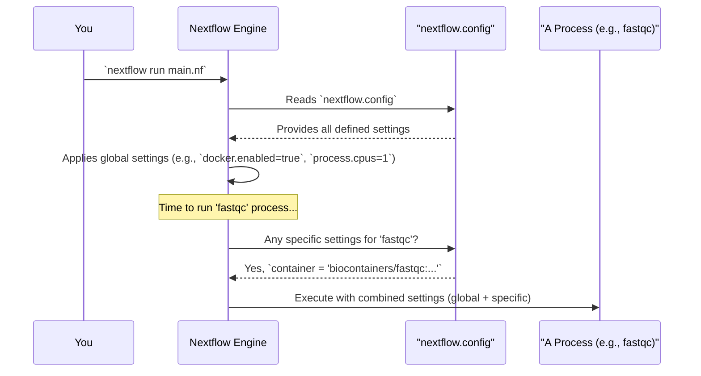

# Chapter 3: Pipeline Configuration (`nextflow.config`)

Welcome back! In [Chapter 2: Parameters (`params`)](02_parameters___params___.md), we learned how to use `params` to create flexible "dials and knobs" for our workflow, allowing us to change input files or settings without rewriting our `main.nf` script. We even saw that default values for these parameters can be set in a special file called `nextflow.config`.

But `nextflow.config` is much more than just a place for default parameters. It's the main control panel for your entire Nextflow pipeline, influencing how it runs, what resources it uses, and how different tools are managed.

## Your Pipeline's Central Control Panel

Imagine our data analysis pipeline is like a complex factory. The `main.nf` file (our [Workflow Definition](01_workflow_definition_.md)) is the blueprint for the factory's assembly line. [Parameters (`params`)](02_parameters___params___.md) are like settings for individual machines on that line that can be adjusted for different product runs.

So, what is `nextflow.config`? It's like the **factory's main control room**. From here, you set overarching operational guidelines:
*   How much power (CPUs, memory) should machines generally use?
*   Are there specific types of machines (e.g., Docker containers with pre-installed software) that certain assembly steps must use?
*   What are the standard operating settings (default parameters) if no specific adjustments are made for a run?

This file, usually named `nextflow.config` and placed in the same directory as your `main.nf` script, allows you to configure the Nextflow execution environment and the behavior of your pipeline's [Process](05_process_.md)es.

## Why Do We Need a `nextflow.config` File?

Let's say you're building a bioinformatics pipeline that uses several different software tools.
1.  **Tool A** needs to run inside a specific Docker container.
2.  **Tool B** is memory-intensive and needs at least 8GB of RAM.
3.  **Tool C** can run with 2 CPUs to speed things up.
4.  By default, you want your output files to go into a folder named "pipeline_outputs".

You *could* try to hardcode some of this into your `main.nf` script, but that makes it messy and less adaptable. What if you want to run the pipeline on a different system where Docker isn't available, or where you have more (or fewer) resources?

The `nextflow.config` file provides a clean, centralized way to manage these kinds of settings. Nextflow automatically looks for and loads this file when your pipeline starts.

## What Can You Configure in `nextflow.config`?

The `nextflow.config` file uses a simple syntax (based on Groovy, but mostly key-value pairs) organized into different sections or "scopes." Let's look at some common ones:

### 1. Default Parameters (`params` scope)

As we saw in the [previous chapter](02_parameters___params___.md), you can set default values for your pipeline parameters:

```groovy
// File: nextflow.config
params {
    output_dir = "results"
    num_cpus_align = 4
    greeting = "Hello from config!"
}
```
If your `main.nf` script uses `params.output_dir`, `params.num_cpus_align`, or `params.greeting`, and you don't override them on the command line, these values from `nextflow.config` will be used.

### 2. Software Management (e.g., `docker` scope)

Modern data analysis often relies on specific software versions. Nextflow makes it easy to manage these using containers (like Docker or Singularity) or Conda environments. You can enable and configure these globally in `nextflow.config`.

To tell Nextflow to use Docker for running your tools:
```groovy
// File: nextflow.config
docker {
    enabled = true
}
```
This simple setting tells Nextflow that, by default, it should try to run processes within Docker containers. You can then specify *which* container each [Process](05_process_.md) uses (we'll see that soon!).

Our project's `nextflow.config` has a slightly more detailed `docker` block:
```groovy
// File: nextflow.config (docker part)
docker {
    enabled = true
    // Extra options for Docker, e.g., for compatibility on Apple Silicon Macs
    runOptions = '--platform=linux/amd64'
}
```
`runOptions` allows you to pass specific command-line arguments to the `docker run` command, which can be useful for advanced scenarios.

### 3. Process Configuration (`process` scope)

This is a very powerful scope. You can define default settings for *all* your [Process](05_process_.md)es, or you can define settings for *specific* named processes.

**General settings for all processes:**
You can set default resources like CPUs or memory that every process should try to use, unless specified otherwise.

```groovy
// File: nextflow.config
process {
    cpus = 1              // Default to 1 CPU for all processes
    memory = '2.GB'       // Default to 2 Gigabytes of memory
    // You can specify a default container for all processes too
    // container = 'ubuntu:latest' 
}
```
Now, every [Process](05_process_.md) in your pipeline will, by default, be allocated 1 CPU and 2GB of memory.

**Settings for specific processes using `withName`:**
Often, different tools have different needs. `ToolA` might be fine with 1 CPU, but `ToolB` might need 4 CPUs and a very specific Docker container.

You use `withName: 'PROCESS_NAME'` to target a specific [Process](05_process_.md) (as defined in your `main.nf` or module files).

Let's look at our project's `nextflow.config`:
```groovy
// File: nextflow.config (process part)
process {
    // Process-specific container configurations
    withName: 'fastqc' {
        container = 'biocontainers/fastqc:v0.11.9_cv8'
    }
    
    withName: 'fastp_trim' {
        container = 'quay.io/biocontainers/fastp:0.23.2--h79da9fb_0'
    }
    
    // The generate_fastq process runs locally (no container)
    withName: 'generate_fastq' {
        container = null // Setting container to null means 'do not use a container'
                         // even if docker.enabled = true
    }
}
```
Here's what this does:
*   Any [Process](05_process_.md) named `fastqc` will run inside the `biocontainers/fastqc:v0.11.9_cv8` Docker image.
*   Any [Process](05_process_.md) named `fastp_trim` will use the `quay.io/biocontainers/fastp:0.23.2--h79da9fb_0` Docker image.
*   The `generate_fastq` [Process](05_process_.md) will *not* run in a container, even if `docker.enabled = true` is set globally. This is useful for tasks that need to interact directly with the host system or are very simple scripts.

You can also set other directives like `cpus`, `memory`, `time`, etc., within a `withName` block:
```groovy
// File: nextflow.config (extending the process block)
process {
    cpus = 1 // Default for all

    withName: 'alignment_step' {
        container = 'my_aligner_image:latest'
        cpus = 8
        memory = '16.GB'
    }

    withName: 'quick_check' {
        // Inherits cpus = 1 from the general process block
        memory = '512.MB' // Needs less memory
    }
}
```

### 4. Other Scopes (Briefly)

There are many other configuration scopes, like:
*   `executor`: Defines how and where Nextflow executes your jobs (e.g., `local` on your machine, `sge`, `slurm`, `awsbatch` on a cluster or cloud).
*   `timeline`, `report`, `trace`: Configure the generation of execution reports.
*   `manifest`: Provides pipeline metadata (author, description, etc.).

For now, `params`, `docker` (or `conda`/`singularity`), and `process` are the most important ones for beginners to understand.

## How Nextflow Uses `nextflow.config`

When you run your pipeline (e.g., `nextflow run main.nf`):

1.  Nextflow starts up.
2.  It automatically looks for a `nextflow.config` file in the directory where `main.nf` is located. (It can also look in other places, but this is the most common setup).
3.  It reads and parses this file.
4.  The settings defined in `nextflow.config` are then applied.
    *   `params` values become the defaults.
    *   Global settings (like `docker.enabled` or default `process.cpus`) are established.
    *   When a specific [Process](05_process_.md) (e.g., `fastqc`) is about to run, Nextflow checks if there are any `withName: 'fastqc'` configurations and applies them (e.g., setting its Docker container).

Think of it like a hierarchy:
1.  Nextflow's built-in defaults (very basic).
2.  Settings from `nextflow.config`.
3.  Settings specified directly in a [Process](05_process_.md) definition in your script (more specific).
4.  Settings from the command line (e.g., `--num_cpus_align 8` or `--output_dir my_run_results`) override almost everything else for `params`.

Here's a simplified view:


## Putting It All Together: Our Project's `nextflow.config`

Let's look at the key parts of our project's `nextflow.config` file that we've discussed:

```groovy
// File: nextflow.config

// Enable Docker by default
docker {
    enabled = true
    runOptions = '--platform=linux/amd64' // Special Docker options
}

// Default parameters
params {
    num_reads = 1000 // Used if params.generate_reads is true
    publish_dir = null // A default for where results might be published
}

// Process-specific configurations
process {
    // Default settings for all processes (could add cpus, memory here)
    // containerOptions = '' // Advanced: options for the container runtime itself
    
    withName: 'fastqc' {
        container = 'biocontainers/fastqc:v0.11.9_cv8'
    }
    
    withName: 'fastp_trim' {
        container = 'quay.io/biocontainers/fastp:0.23.2--h79da9fb_0'
    }
    
    withName: 'generate_fastq' {
        container = null // This process doesn't need a container
    }
}
```
When this pipeline runs:
*   Docker will be enabled.
*   If `params.generate_reads` is true (and not overridden), `params.num_reads` will default to 1000.
*   The `fastqc` [Process](05_process_.md) will use its specified container.
*   The `fastp_trim` [Process](05_process_.md) will use its specified container.
*   The `generate_fastq` [Process](05_process_.md) will run without a container.
*   Any other [Process](05_process_.md) not explicitly mentioned would use global `process` defaults (if any were set) and the global `docker.enabled = true` setting (meaning Nextflow might try to find a container for it, or you'd need to specify one).

This configuration file ensures that our pipeline behaves consistently and uses the correct software environments and resources without cluttering our main workflow logic in `main.nf`.

## What We've Learned

The `nextflow.config` file is a vital part of your Nextflow project.
*   It's the **central control panel** for pipeline execution settings.
*   It allows you to define **default parameters** (`params` scope).
*   You can manage **software environments** (e.g., using the `docker` scope to enable Docker).
*   You can set **resource allocations** (CPUs, memory) and other directives for all [Process](05_process_.md)es or for specific ones using the `process` scope and `withName` selectors.
*   It helps keep your main workflow script (`main.nf`) clean and focused on logic, while `nextflow.config` handles the "how-to-run" details.

## Next Steps

We've seen how the `main.nf` defines the workflow, `params` make it flexible, and `nextflow.config` sets up the environment. But how does data actually *flow* between the steps in our workflow? That's where a crucial Nextflow concept comes into play: Channels.

Get ready to explore how data is passed around in your pipeline with [Chapter 4: Channel](04_channel_.md).

---

Generated by [AI Codebase Knowledge Builder](https://github.com/The-Pocket/Tutorial-Codebase-Knowledge)