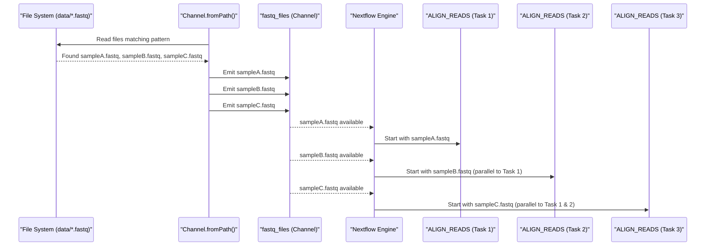

# Chapter 4: Channel

Welcome back! In [Chapter 3: Pipeline Configuration (`nextflow.config`)](03_pipeline_configuration___nextflow_config___.md), we saw how `nextflow.config` acts as the central control panel for our pipeline, setting up things like default parameters and software environments. We know our `main.nf` defines the steps, and `params` make it flexible. But how does the actual *data* get from one step to the next?

Imagine our pipeline is a factory. We have different workstations (our analysis tools or [Process](05_process_.md)es). How do items (our data files or values) move from one workstation to the next efficiently, especially if some workstations are faster than others or if we want to process many items at once? We need **conveyor belts**!

In Nextflow, these conveyor belts are called **Channels**.

## What are Channels? Your Data's Conveyor Belts

**Channels** are the communication lines that carry data between different [Process](05_process_.md)es or workflow steps. They are fundamental to Nextflow, enabling data to flow smoothly and allowing tasks to run as soon as their input data is ready (this is called asynchronous execution).

Think of them like this:
*   A **producer** (an upstream process or a channel factory) places items onto the conveyor belt (channel).
*   A **consumer** (a downstream process) picks up items from the conveyor belt when it's ready.

This system allows different parts of your pipeline to work independently and in parallel, significantly speeding up complex analyses.

An item on a channel can be:
*   A simple value (like a number or a string).
*   A file path.
*   A collection of file paths (like a pair of FASTQ files for paired-end sequencing).
*   More complex data structures (like a `tuple` which groups multiple values).

## Creating Channels: Where Do They Come From?

You don't usually create conveyor belts from thin air; you manufacture them or get them from a supplier. Similarly, in Nextflow, channels are created using special methods called "channel factories" or they are the outputs of [Process](05_process_.md)es.

Let's look at a few common ways to create channels:

**1. `Channel.of()`: For a fixed set of simple items**
This creates a *queue channel* with the specified items. A queue channel is like a typical conveyor belt where items are processed one by one.

```groovy
// Creates a channel that will emit: 1, then 2, then 3
number_channel = Channel.of(1, 2, 3, "hello")
```
Here, `number_channel` will first provide `1`, then `2`, then `3`, and finally `"hello"`.

**2. `Channel.fromPath()`: For files from your computer**
This is super useful for grabbing input files. It can take a specific file name or a "glob pattern" (like `*` or `?`) to match multiple files.

```groovy
// Creates a channel emitting each FASTQ file in the 'data' folder
fastq_files = Channel.fromPath("data/*.fastq")
```
If you have `data/sampleA.fastq` and `data/sampleB.fastq`, this channel will emit the path to `sampleA.fastq` as one item, and then the path to `sampleB.fastq` as another.

**3. `Channel.fromFilePairs()`: For paired files**
Bioinformatics often deals with paired-end reads (e.g., `_R1.fastq` and `_R2.fastq`). This factory helps group them.

```groovy
// Groups paired FASTQ files from the 'data/reads' folder
// e.g., sample1_1.fastq with sample1_2.fastq
paired_reads_channel = Channel.fromFilePairs("data/reads/*_{1,2}.fastq")
```
This channel will emit items where each item is a list. The first element of the list is the "pair ID" (e.g., `sample1` from `sample1_1.fastq`), and the second element is another list containing the actual file paths for the pair. For example, one item might look like: `[ "sample1", [ /path/to/data/reads/sample1_1.fastq, /path/to/data/reads/sample1_2.fastq ] ]`.

**4. `Channel.value()`: For a single, reusable value**
Sometimes, you have a single piece of information (like a reference genome file) that many process instances need. A *value channel* (or singleton channel) provides this. It emits the same single value an infinite number of times if requested, but typically it's used when a process just needs one copy of that value.

```groovy
// Creates a channel that emits a single file path
ref_genome_channel = Channel.value("/path/to/reference.fasta")
```
This channel will always provide `/path/to/reference.fasta`.

## How Channels Connect to Processes

Okay, we have these conveyor belts (channels). How do they connect to the workstations ([Process](05_process_.md)es)?

A [Process](05_process_.md) (which we'll explore in detail in the [next chapter](05_process_.md)) defines its inputs and outputs using channels.

Let's look at a simplified example from our `main.nf`:
```groovy
// File: main.nf (snippet)
workflow {
    if (params.generate_reads) {
        generate_fastq()             // This is a Process
        input_channel = generate_fastq.out // '.out' is its output channel
    } else {
        // If using existing paired-end reads
        input_channel = Channel.fromFilePairs(params.reads, size: 2)
        // ... (more on the .map part later)
    }

    // The 'process_reads' sub-workflow takes 'input_channel' as its input
    process_reads(input_channel)
}
```
*   `generate_fastq()`: This is a call to a [Process](05_process_.md) named `generate_fastq`.
*   `generate_fastq.out`: [Process](05_process_.md)es can declare output channels. `.out` is a common way to refer to the main output channel of a process. So, `generate_fastq.out` *is* a channel containing the data produced by `generate_fastq`. We store this channel in a variable called `input_channel`.
*   `Channel.fromFilePairs(params.reads, size: 2)`: If we're not generating reads, we create `input_channel` directly using a channel factory, based on the file path pattern given in `params.reads`.
*   `process_reads(input_channel)`: We then pass this `input_channel` to our `process_reads` [Sub-workflow (`process_reads`)](07_sub_workflow___process_reads___.md). Inside `process_reads`, other [Process](05_process_.md)es will take their inputs from this channel.

Think of it as plugging the end of one conveyor belt (`generate_fastq.out` or the one from `Channel.fromFilePairs`) into the start of another machine or set of machines (`process_reads`).

## Channel Operators: Modifying the Flow

Channels aren't just static pipes; they are dynamic! You can use **operators** to transform, filter, split, or combine the data flowing through them. This is like adding special processing units or diverters to your conveyor belt.

Let's look at a couple of simple ones:

**1. `view()`: Peeking at the data**
The `view()` operator lets you print out the items in a channel as they pass by. It's incredibly useful for debugging!

```groovy
my_numbers = Channel.of(10, 20, 30)
my_numbers.view { item -> "Viewed item: ${item}" }
```
If you ran this in a Nextflow script (e.g., inside a `workflow` block), it would print:
```
Viewed item: 10
Viewed item: 20
Viewed item: 30
```
The `view()` operator doesn't change the channel; it just lets you see its contents. The channel `my_numbers` can still be passed to another process.

**2. `map()`: Transforming each item**
The `map()` operator takes each item from a channel, applies a transformation you define, and creates a new channel with the transformed items.

In our project's `main.nf`, when using existing files, we see this:
```groovy
// ...
input_channel = Channel.fromFilePairs(params.reads, size: 2)
                .map { id, files -> tuple(id, files[0], files[1]) }
// ...
```
Let's break this down:
*   `Channel.fromFilePairs(params.reads, size: 2)`: As we saw, this creates items like `[ "sample1", [file1_path, file2_path] ]`.
*   `.map { id, files -> ... }`: For each such item, the `map` operator takes it apart. `id` gets `sample1`, and `files` gets `[file1_path, file2_path]`.
*   `tuple(id, files[0], files[1])`: We then create a `tuple`. A tuple is just a fixed-size collection of items. Here, it becomes `( "sample1", file1_path, file2_path )`.
So, the `input_channel` that goes into `process_reads` will emit items like `( "sample1", /path/to/sample1_1.fastq, /path/to/sample1_2.fastq )`, which is a convenient format for downstream [Process](05_process_.md)es.

There are many other powerful operators (`filter`, `flatMap`, `groupTuple`, `combine`, `mix`, etc.), but `map` and `view` give you a good starting idea.

## Channels and Parallelism: The Magic of Nextflow

This is where channels truly shine and make Nextflow so powerful. When a [Process](05_process_.md) receives input from a channel that emits multiple items, Nextflow can automatically run multiple instances of that process *in parallel*, one for each item (or batch of items).

Imagine you have a channel `fastq_files` that emits:
1.  `sampleA.fastq`
2.  `sampleB.fastq`
3.  `sampleC.fastq`

And a [Process](05_process_.md) called `ALIGN_READS` that takes one FASTQ file as input from this channel.

```groovy
// Simplified concept
process ALIGN_READS {
    input:
    path fastq_file from fastq_files // 'path' declares it expects a file path

    script:
    "bwa_aligner ${fastq_file} ..." // A fictional alignment command
}

workflow {
    fastq_files = Channel.fromPath("data/*.fastq")
    ALIGN_READS(fastq_files)
}
```
Nextflow sees three items coming from `fastq_files`. It can then launch three `ALIGN_READS` tasks simultaneously (if you have enough computer resources):
*   Task 1: `ALIGN_READS` with `sampleA.fastq`
*   Task 2: `ALIGN_READS` with `sampleB.fastq`
*   Task 3: `ALIGN_READS` with `sampleC.fastq`

This happens automatically! You don't need to write complicated code to manage parallel execution. The channels and processes handle it.

Here's a diagram illustrating this:


This inherent parallelism, managed through channels, is a core reason why Nextflow is so efficient for large-scale data analysis.

## Channels in Our Project: A Closer Look

Let's revisit the `main.nf` workflow structure, focusing on channels:
```groovy
// File: main.nf (main workflow snippet)
workflow {
    // 1. Create 'input_channel'
    if (params.generate_reads) {
        generate_fastq()                      // A Process is called
        input_channel = generate_fastq.out    // Its output IS a channel
    } else {
        if (params.paired_end) {
            // Factory creates a channel, map transforms it
            input_channel = Channel.fromFilePairs(params.reads, size: 2)
                                 .map { id, files -> tuple(id, files[0], files[1]) }
        } else {
            // Factory for single files, map transforms it
            input_channel = Channel.fromPath(params.reads)
                                 .map { file -> tuple(file.baseName, file, null) }
        }
    }

    // 2. 'input_channel' is passed to the sub-workflow
    process_reads(input_channel)
}
```
And inside the `process_reads` sub-workflow:
```groovy
// File: main.nf (process_reads sub-workflow snippet)
workflow process_reads {
    take: // Declares it expects an input channel
        input_channel  // This will be the channel we created above

    main:
        // Example: fastqc_raw_wf (another sub-workflow) takes its input
        // from 'input_reads', which is derived from 'input_channel'
        input_reads = input_channel.flatMap { id, r1, r2 -> 
                          r2 ? [ [id, r1], [id, r2] ] : [ [id, r1] ] 
                      }
        fastqc_raw_wf("${params.outdir}/fastqc_raw", input_reads)
        
        // Example: fastp_trim (a Process) takes 'input_channel' directly
        trimming = fastp_trim(input_channel) // 'trimming' becomes an output channel
        
        // ... other steps also use channels derived from 'input_channel' or 'trimming'
    emit: // Declares an output channel
        trimmed = trimming
}
```
Notice how channels are:
*   **Created** (by process outputs like `generate_fastq.out` or factories like `Channel.fromFilePairs`).
*   **Transformed** (using operators like `.map` or `.flatMap`).
*   **Passed** as inputs to [Process](05_process_.md)es (like `fastp_trim`) or other [Sub-workflow (`process_reads`)](07_sub_workflow___process_reads___.md)s (like `fastqc_raw_wf`).
*   **Outputted** by [Process](05_process_.md)es (e.g., `fastp_trim` produces the `trimming` channel) and [Sub-workflow (`process_reads`)](07_sub_workflow___process_reads___.md)s (the `emit: trimmed` block makes the `trimming` channel available as an output of `process_reads`).

This flow of data through channels is what connects all the pieces of your Nextflow pipeline.

## What We've Learned

Channels are the lifeblood of a Nextflow pipeline!
*   They are like **conveyor belts** carrying data (values, files) between workflow steps.
*   They are created by **channel factories** (e.g., `Channel.of()`, `Channel.fromPath()`) or are the **outputs of processes**.
*   **Channel operators** (like `map`, `view`) allow you to transform and manipulate the data stream.
*   Crucially, channels enable Nextflow to **automatically parallelize** tasks by processing multiple channel items concurrently.
*   They define the **data dependencies** and flow within your workflow.

## Next Steps

We've seen how data flows through channels. Now, let's learn about the "workstations" that actually do the work: the [Process](05_process_.md). These are the building blocks that consume data from input channels, execute your tools or scripts, and produce data for output channels.

Get ready to dive into [Chapter 5: Process](05_process_.md)!

---

Generated by [AI Codebase Knowledge Builder](https://github.com/The-Pocket/Tutorial-Codebase-Knowledge)