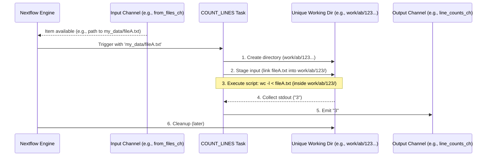

# Chapter 4: Process Execution Unit

Welcome to Chapter 4! In [Chapter 3: Channel (Data Flow)](03_channel__data_flow__.md), we learned how **Channels** act like conveyor belts, moving data items smoothly between different stages of our pipeline. Now, it's time to zoom in on the "workstations" themselves – the components that actually *do the work* on this data. In Nextflow, these individual, independent computational tasks are called **Processes**.

Imagine our DNA sequencing pipeline again. We have steps like:
1.  Checking the quality of raw DNA sequences (e.g., using a tool called FastQC).
2.  Trimming away low-quality parts or adapter sequences (e.g., using a tool called `fastp`).
3.  Aligning sequences to a genome.

Each of these specific jobs is handled by a Nextflow `process`. A `process` is like a specialized workstation on an assembly line, responsible for one specific job. It takes specific inputs (e.g., a FASTQ file), runs a script (often a command-line tool like `fastp`), and produces outputs (e.g., a trimmed FASTQ file) that can then be passed along to other processes via channels.

## What Problem Does a `process` Solve?

Processes are the fundamental building blocks where computation happens in Nextflow. They solve the problem of **defining and executing an individual, self-contained task** within your larger workflow. They allow you to:

*   Specify the exact commands or scripts to run for a particular step.
*   Define what input data that step needs.
*   Declare what output data that step will produce.
*   Isolate the execution of this task, making your pipeline modular and easier to manage.

Let's say our use case is to **count the number of lines in a text file**. This is a simple, distinct task. A Nextflow `process` is perfect for defining how to do this.

## Anatomy of a Nextflow `process`

A `process` in Nextflow is defined using the `process` keyword followed by a name and a block of directives enclosed in curly braces `{}`. The three most essential parts of a process are:

1.  **`input`**: Declares what kind of data the process expects to receive. This data usually comes from a [Channel (Data Flow)](03_channel__data_flow__.md).
2.  **`output`**: Declares what kind of data the process will produce. These outputs are typically sent out on new [Channels](03_channel__data_flow__.md).
3.  **`script`**: Contains the actual shell commands or code (e.g., Bash, Python, R) that will be executed to perform the task.

Let's look at a very simple `process` that takes a message and prints it:

```nextflow
// main_process_simple.nf
nextflow.enable.dsl=2

process GREET_PERSON {
    input:
    val person_name // Expects a simple value named 'person_name'

    output:
    stdout into greeting_channel // Captures standard output into 'greeting_channel'

    script:
    """
    echo "Hello, ${person_name}!"
    """
}

workflow {
    // Create a channel with names
    name_channel = Channel.of("Alice", "Bob")

    GREET_PERSON(name_channel) // Feed names to the process

    greeting_channel.view() // See the output
}
```

Let's break down the `GREET_PERSON` process:
*   `process GREET_PERSON { ... }`: This defines a process named `GREET_PERSON`.
*   `input: val person_name`: This tells Nextflow that `GREET_PERSON` expects one input item at a time. `val` indicates it's a simple value (like a string or number), and we'll refer to it as `person_name` inside the process.
*   `output: stdout into greeting_channel`: This says that whatever the script prints to its standard output (`stdout`) should be captured and put into a new channel named `greeting_channel`. Each line printed will be an item on this channel.
*   `script: """ echo "Hello, ${person_name}!" """`: This is the command to be executed.
    *   Notice `${person_name}`. Nextflow automatically makes input variables (like `person_name`) available within the script block. When the process runs for "Alice", `${person_name}` will be replaced with "Alice".
    *   The `""" ... """` (triple quotes) allow you to write multi-line scripts.

When you run `nextflow run main_process_simple.nf`, the output will be (order might vary):
```
N E X T F L O W  ~  version ...
Launching `main_process_simple.nf` [some_name] - revision: ...
[process_id] process > GREET_PERSON (1) [100%] 2 of 2 ✔
Hello, Alice!
Hello, Bob!
```
The `workflow` block creates a `name_channel` with "Alice" and "Bob". Then, `GREET_PERSON(name_channel)` tells Nextflow to run the `GREET_PERSON` process for each item from `name_channel`. The `greeting_channel.view()` then prints the outputs.

## Working with Files in Processes

Often, processes work with files. Let's define a process to count lines in a file.

**1. Declaring File Inputs:**
You use `path` in the `input` block to signify that an input is a file path.

```nextflow
// Create a dummy file for testing
// In your terminal:
// mkdir -p my_data
// echo -e "line1\nline2\nline3" > my_data/fileA.txt
// echo -e "another line" > my_data/fileB.txt

// main_process_files.nf
nextflow.enable.dsl=2

process COUNT_LINES {
    input:
    path my_file // Expects a file path, will be available as 'my_file'

    output:
    stdout into line_counts_ch // Output the count

    script:
    """
    wc -l < ${my_file} | awk '{print $1}'
    """
    // wc -l < some_file.txt  counts lines in some_file.txt
    // | awk '{print $1}'   extracts just the number
}

workflow {
    // Create a channel from files
    Channel.fromPath("my_data/*.txt")
        .set { files_to_process_ch }

    COUNT_LINES(files_to_process_ch)

    line_counts_ch.view { count -> "File had ${count} lines" }
}
```
*   `input: path my_file`: Declares an input file path. When the process runs, `my_file` will be a variable holding the actual path to the input file Nextflow is processing for that task. Nextflow automatically makes this file available to the script.
*   `script: wc -l < ${my_file} ...`: The `wc -l` command is used with the input file path `${my_file}`.

If you run this (after creating `my_data/fileA.txt` and `my_data/fileB.txt`), the output will be (order might vary):
```
File had 3 lines
File had 1 lines
```

**2. Declaring File Outputs:**
Processes often create new files as output. You use `path` in the `output` block to tell Nextflow which files, created by your script, should be captured as outputs.

Let's imagine a process that takes a file, adds a prefix to its content, and saves it to a new file.

```nextflow
// main_process_output_files.nf
nextflow.enable.dsl=2

process ADD_PREFIX_TO_FILE {
    input:
    path input_file
    val prefix

    output:
    path "prefixed_${input_file.name}" into prefixed_files_ch
    // Declares an output file. Its name is constructed using the input file's name.

    script:
    """
    echo "${prefix}: Start of file" > "prefixed_${input_file.name}"
    cat "${input_file}" >> "prefixed_${input_file.name}"
    echo "${prefix}: End of file" >> "prefixed_${input_file.name}"
    """
}

workflow {
    // Assume my_data/fileA.txt and my_data/fileB.txt exist from previous example
    input_files_ch = Channel.fromPath("my_data/*.txt")
    
    // We need to combine the file channel with a prefix value.
    // .combine operator creates pairs: (fileA, "LOG"), (fileB, "LOG")
    input_files_ch
        .combine( Channel.of("LOG_A", "LOG_B") ) // Let's give unique prefixes
        .set { combined_input_ch }

    ADD_PREFIX_TO_FILE(combined_input_ch)

    prefixed_files_ch.view { file_path ->
        println "Created prefixed file: ${file_path}"
        println "--- Content of ${file_path} ---"
        println file_path.text // .text reads the file content (for small files)
        println "--------------------------"
    }
}
```
*   `input: path input_file, val prefix`: This process now takes two inputs per item: a file and a prefix string.
*   `output: path "prefixed_${input_file.name}" into prefixed_files_ch`:
    *   This tells Nextflow to look for a file whose name matches the pattern `"prefixed_${input_file.name}"` in the process's working directory after the script finishes.
    *   `${input_file.name}` gives the name of the input file (e.g., "fileA.txt"). So, if `input_file` was `my_data/fileA.txt`, Nextflow expects a file named `prefixed_fileA.txt`.
    *   This output file will then be sent to the `prefixed_files_ch` channel.
*   `script:`: The script creates the output file (e.g., `prefixed_fileA.txt`) by redirecting `echo` and `cat` outputs.

When run, this pipeline will create new files (e.g., `prefixed_fileA.txt`, `prefixed_fileB.txt`) in its temporary working directories. The `view` operator will show their paths and content. For example, for `fileA.txt` and prefix "LOG_A", the output file `prefixed_fileA.txt` would contain:
```
LOG_A: Start of file
line1
line2
line3
LOG_A: End of file
```

**3. Tuples for Multiple Inputs/Outputs**
Often, you need to pass multiple related pieces of data together (like a sample ID and its corresponding FASTQ files). You can use `tuple` in `input` and `output` declarations.

```nextflow
process PROCESS_SAMPLE {
    input:
    tuple val(sample_id), path(reads_file) // Expects a pair: (ID, file_path)

    output:
    tuple val(sample_id), stdout // Outputs the ID and whatever the script prints

    script:
    """
    echo "Processing ${sample_id} from file ${reads_file}"
    # Actual processing commands would go here
    """
}
```
This process expects each item from its input channel to be a tuple (a fixed-size collection) containing a `sample_id` (a value) and a `reads_file` (a path). It then outputs the `sample_id` along with the standard output of the script.

## How a Process Executes: A Peek Under the Hood

When Nextflow decides to run a task for a process (e.g., because an item arrived in its input channel), it does the following:

1.  **Prepare a Unique Working Directory**: Nextflow creates a temporary, isolated directory specifically for this one task. This ensures that parallel tasks for the same process don't interfere with each other. For example: `work/3d/c8a0729b9917676fa913f97200577f/`.
2.  **Stage Inputs**:
    *   Input values (from `val`) are made available as shell variables.
    *   Input files (from `path`) are "staged" into this working directory. This usually means Nextflow creates a symbolic link (a kind of shortcut) from the working directory to the actual location of the input file. This makes the file appear as if it's directly inside the working directory.
3.  **Execute the Script**: The commands defined in the `script` block are executed within this unique working directory. The script can refer to input variables (e.g., `${sample_id}`) and input files (e.g., `${reads_file}`) as if they are local.
4.  **Collect Outputs**:
    *   If `stdout` is declared as an output, Nextflow captures what the script prints to the console.
    *   If `path` outputs are declared (e.g., `path "output.txt"`), Nextflow looks for files matching these patterns *within the working directory*. These found files are then managed by Nextflow.
5.  **Emit to Output Channels**: The collected outputs (standard output lines, paths to output files) are sent as items to the corresponding output channels.
6.  **Cleanup (Optional)**: By default, Nextflow keeps the working directories for successful tasks for a while (useful for debugging or resuming). They can be configured to be cleaned up.

Let's visualize this with a simplified diagram for a single task:


This isolation and automatic handling of file staging is a powerful feature, making your scripts simpler and your pipeline more robust.

## Processes in Our Project

Our course project uses several processes defined in the `modules/` directory. Let's look at `modules/fastp/trim.nf`, which trims FASTQ files.

**File: `modules/fastp/trim.nf` (Simplified)**
```nextflow
// Process to trim reads with fastp
process fastp_trim {
    // publishDir tells Nextflow where to copy final results (more in next chapter)
    publishDir "${params.outdir}/trimmed", mode: 'copy'

    input:
    tuple val(id), path(read1), path(read2) // Expects sample ID, and two read files

    output:
    tuple val(id), path("trimmed_${id}_R1.fastq"), \
                   path("trimmed_${id}_R2.fastq", optional: true)
    // Outputs ID, and paths to trimmed R1 and R2 files
    // 'optional: true' means the R2 file might not exist (for single-end data)

    script:
    // The actual command to run fastp
    // ${id}, ${read1}, ${read2} are substituted by Nextflow
    if (read2) { // Check if read2 was provided (for paired-end)
        """
        fastp -i ${read1} -I ${read2} -o trimmed_${id}_R1.fastq -O trimmed_${id}_R2.fastq
        """
    } else { // For single-end
        """
        fastp -i ${read1} -o trimmed_${id}_R1.fastq
        """
    }
}
```
Let's examine its key parts:
*   **`input: tuple val(id), path(read1), path(read2)`**:
    This process expects to receive a tuple for each sample. This tuple contains:
    1.  `id`: A value (e.g., a sample name like "sampleX").
    2.  `read1`: The path to the first FASTQ file (e.g., `input_data/sampleX_R1.fastq`).
    3.  `read2`: The path to the second FASTQ file (e.g., `input_data/sampleX_R2.fastq`).
*   **`output: tuple val(id), path("trimmed_${id}_R1.fastq"), path("trimmed_${id}_R2.fastq", optional: true)`**:
    After the script runs, this process will output another tuple:
    1.  `id`: The same sample ID it received.
    2.  `path("trimmed_${id}_R1.fastq")`: The path to the trimmed first read file. If `id` was "sampleX", Nextflow looks for a file named `trimmed_sampleX_R1.fastq` created by the script.
    3.  `path("trimmed_${id}_R2.fastq", optional: true)`: The path to the trimmed second read file. `optional: true` means if this file isn't found (e.g., if we processed single-end data and the script didn't create it), Nextflow won't complain.
*   **`script:`**:
    *   `if (read2)`: This Groovy `if` statement checks if the `read2` input path was actually provided.
    *   `fastp -i ${read1} -I ${read2} -o trimmed_${id}_R1.fastq -O trimmed_${id}_R2.fastq`: This is the command-line call to the `fastp` tool.
        *   `${read1}` and `${read2}` will be replaced with the actual paths to the input FASTQ files for the current task.
        *   `trimmed_${id}_R1.fastq` and `trimmed_${id}_R2.fastq` are the names of the output files `fastp` will create. These names match what's declared in the `output` block.

**Another Example: `modules/fastq/generate.nf`**
This process generates synthetic FASTQ files.
```nextflow
// From: modules/fastq/generate.nf (simplified)
process generate_fastq {
    output:
    tuple val("synthetic"), path("synthetic_R1.fastq"), \
                           path("synthetic_R2.fastq", optional: true)

    script:
    // Uses params.paired_end and params.num_reads from pipeline parameters
    if (params.paired_end) {
        """
        fastq-generator ... --nb_seq ${params.num_reads ?: 1000} --output synthetic_R1.fastq
        fastq-generator ... --nb_seq ${params.num_reads ?: 1000} --output synthetic_R2.fastq
        """
    } else {
        """
        fastq-generator ... --nb_seq ${params.num_reads ?: 1000} --output synthetic_R1.fastq
        touch synthetic_R2.fastq // Create an empty R2 file if single-end
        """
    }
}
```
*   **No `input` block**: This process doesn't take data from other processes via channels. It generates data from scratch. It does, however, use [Pipeline Parameters (`params`)](02_pipeline_parameters___params___.md) like `params.paired_end` and `params.num_reads` to control its behavior.
*   **`output`**: It outputs a tuple containing a fixed ID "synthetic" and the paths to the generated `synthetic_R1.fastq` and (optionally) `synthetic_R2.fastq` files. These files are created by the `fastq-generator` tool in the `script` block.

These examples show how processes encapsulate specific tools and operations, clearly defining their inputs, outputs, and the script to run.

## Conclusion

The **Process Execution Unit** is where the real work of your pipeline gets done. Each `process` is a self-contained, independent task that:
*   Receives inputs (values or files) from [Channels](03_channel__data_flow__.md).
*   Executes a `script` (usually command-line tools) in an isolated environment.
*   Produces outputs (values or files) that are sent to new [Channels](03_channel__data_flow__.md).

By defining processes, you break down your complex bioinformatics analysis into manageable, reusable, and parallelizable steps. Nextflow takes care of running these processes, managing their dependencies, and handling their data.

Now that we understand how to define individual tasks (processes) and how data flows between them (channels), you might be wondering how to manage settings that apply to the whole pipeline or to specific processes – things like where to run jobs, how much memory or CPU they need, or which software containers to use. That's where the Nextflow configuration file comes in!

Let's explore how to fine-tune your pipeline's execution environment and behavior in the next chapter: [Configuration (`nextflow.config`)](05_configuration___nextflow_config___.md).

---

Generated by [AI Codebase Knowledge Builder](https://github.com/The-Pocket/Tutorial-Codebase-Knowledge)