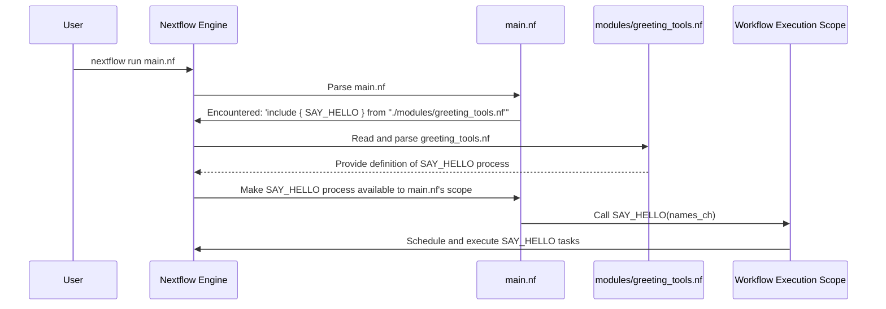

# Chapter 6: Modular Components (Modules)

In [Chapter 5: Configuration (`nextflow.config`)](05_configuration___nextflow_config___.md), we saw how the `nextflow.config` file acts as a central control panel, allowing us to manage execution environments and global settings for our pipeline. This separation of configuration from logic is great! But what happens when our main pipeline script, `main.nf`, starts to grow very long, filled with many different [Process Execution Unit](04_process_execution_unit_.md) definitions? It can become hard to read, manage, and reuse parts of it. This is where **Modular Components**, or **Modules**, come into play.

## What Problem Do Modules Solve? The Case for Tidy Pipelines

Imagine you're building with LEGOs. You have individual bricks (like simple commands), and you can assemble them into small, functional units – say, a wheel assembly, an engine block, or a cockpit. Then, you can combine these units to build different models: a car, a plane, or a spaceship.

If your `main.nf` file contains *every single process definition* for a complex pipeline, it's like trying to carve a spaceship entirely out of one giant block of wood. It's hard to manage, and if you want to build a car later that needs a similar engine, you'd have to carve it all over again!

**Modules** in Nextflow are like those pre-fabricated LEGO units. They allow you to:
*   **Organize your code**: Break down a large pipeline into smaller, manageable files.
*   **Reuse components**: Define a common process (like one for running FastQC) once in a module, and then use it in many different pipelines, or multiple times within the same pipeline.
*   **Improve maintainability**: If you need to update a tool or a process, you only change it in its module file.
*   **Facilitate collaboration**: Different team members can work on different modules independently.

Let's say we have a process for trimming adapter sequences from DNA reads. It's a common task.
*   **Without modules**: We'd define this `TRIM_READS` process directly in our `main.nf`. If `main.nf` grows large, finding and understanding `TRIM_READS` becomes harder. If we start a new project that also needs read trimming, we might copy-paste the `TRIM_READS` definition, leading to code duplication.
*   **With modules**: We define `TRIM_READS` in its own separate file (a module). Our `main.nf` then simply "imports" and uses it. This keeps `main.nf` cleaner and makes `TRIM_READS` easily reusable.

## What is a Nextflow Module? Your Reusable Toolkit

A Nextflow **module** is typically a self-contained `.nf` file that defines one or more [Process Execution Unit](04_process_execution_unit_.md)s or even small sub-workflows. Think of them as standardized, pre-fabricated components that you can plug into your main pipeline.

*   **A module file** is just a Nextflow script, often containing process definitions.
*   **It's self-contained**: Ideally, a module only relies on its inputs and [Pipeline Parameters (`params`)](02_pipeline_parameters___params___.md) to do its job.
*   **It's reusable**: The same module file can be included in different Nextflow projects.

## Creating and Using a Simple Module

Let's walk through creating and using a very basic module. Our goal: create a module that has a process to say hello.

**Step 1: Create the Module File**

First, it's good practice to create a directory to hold your modules, commonly named `modules/`. Inside this directory, let's create a file named `greeting_tools.nf`.

```nextflow
// File: modules/greeting_tools.nf

nextflow.enable.dsl=2 // Good practice to include in module files too

process SAY_HELLO {
    input:
    val name

    output:
    stdout

    script:
    """
    echo "Hello, ${name} from the module!"
    """
}
```
*   This `modules/greeting_tools.nf` file defines a single, simple process called `SAY_HELLO`. It takes a `name` as input and prints a greeting.

**Step 2: Import the Module into Your Main Script**

Now, in your main pipeline script (e.g., `main.nf`), you need to tell Nextflow about this module and what you want to use from it. This is done using the `include` keyword.

```nextflow
// File: main.nf
nextflow.enable.dsl=2

// Import the SAY_HELLO process from our module file
include { SAY_HELLO } from './modules/greeting_tools.nf'

workflow {
    names_ch = Channel.of("Alice", "Bob")

    SAY_HELLO(names_ch) // Use the imported process
    SAY_HELLO.out.view() // View its output
}
```
*   `include { SAY_HELLO } from './modules/greeting_tools.nf'`:
    *   `include { ... }`: This is the statement to import components.
    *   `SAY_HELLO`: This is the name of the process (or workflow) we want to import from the module file. It must match a name defined in `greeting_tools.nf`.
    *   `from './modules/greeting_tools.nf'`: This specifies the path to the module file. The path is relative to the script doing the including (in this case, `main.nf`).

**Step 3: Use the Imported Component in Your Workflow**

Once imported, `SAY_HELLO` behaves just like a process defined directly in `main.nf`.

When you run `nextflow run main.nf`, you'll see:
```
N E X T F L O W  ~  version ...
Launching `main.nf` [some_name] - revision: ...
[process_id] process > SAY_HELLO (1) [100%] 2 of 2 ✔
Hello, Alice from the module!
Hello, Bob from the module!
```
Success! Our `main.nf` is cleaner, and the `SAY_HELLO` logic is neatly tucked away in its own module file, ready to be reused.

## Organizing Modules: The `modules` Directory

As shown, it's a common convention to place all your module files in a dedicated `modules/` directory at the root of your project.
```
my_pipeline/
├── main.nf
├── nextflow.config
├── modules/
│   ├── greeting_tools.nf
│   ├── fastqc.nf
│   └── alignment_tools.nf
└── data/
    └── ...
```
For larger projects, you can even have subdirectories within `modules/` for better organization, for example:
`modules/qc/fastqc.nf`
`modules/alignment/bwa.nf`

If `greeting_tools.nf` was inside `modules/common/`, the include path would be `'./modules/common/greeting_tools.nf'`.

## Importing Multiple Components and Aliasing

A single module file can define multiple processes or workflows.

**Importing Multiple Components:**
If `multi_tools.nf` defined `PROCESS_A` and `PROCESS_B`:
```nextflow
// In main.nf
include { PROCESS_A; PROCESS_B } from './modules/multi_tools.nf'

workflow {
    PROCESS_A(...)
    PROCESS_B(...)
}
```
You list the components you want to import, separated by semicolons.

**Aliasing: Giving Nicknames to Imported Components**
Sometimes, you might want to import a component but use it with a different name in your `main.nf`. This is called **aliasing**, and it's done with the `as` keyword.
Reasons for aliasing:
1.  **Avoid name clashes**: If `main.nf` already has a component named `MY_PROCESS` and you import another `MY_PROCESS` from a module.
2.  **Clarity**: Use a more descriptive name in `main.nf`.
3.  **Using the same module multiple times for different steps**: This is a common pattern.

Imagine `modules/generic_tool.nf` defines `RUN_TOOL`. We want to use it twice, once for "task1" and once for "task2".

```nextflow
// File: main.nf
include { RUN_TOOL as RUN_TASK_1; RUN_TOOL as RUN_TASK_2 } from './modules/generic_tool.nf'

workflow {
    input_for_task1 = Channel.of("data1")
    input_for_task2 = Channel.of("data2")

    RUN_TASK_1(input_for_task1)
    RUN_TASK_2(input_for_task2)
    
    RUN_TASK_1.out.view { out1 -> "Task 1 output: $out1" }
    RUN_TASK_2.out.view { out2 -> "Task 2 output: $out2" }
}
```
*   `RUN_TOOL as RUN_TASK_1`: We import `RUN_TOOL` from the module, but in our `main.nf`, we'll refer to this instance as `RUN_TASK_1`.
*   `RUN_TOOL as RUN_TASK_2`: We import `RUN_TOOL` again, but this time we call it `RUN_TASK_2`.

This allows you to use the same underlying module logic for different conceptual steps in your workflow.

## How Nextflow Handles Modules: A Look Under the Hood

When Nextflow encounters an `include` directive, it performs a few key actions:

1.  **Locate**: It resolves the path provided in the `from` part and finds the module file.
2.  **Parse**: It reads and parses the module file, identifying all the process and workflow definitions within it.
3.  **Expose**: It makes the requested components (those listed in the `include { ... }` block, using their original names or aliases) available to the script that did the including. It's as if those process/workflow definitions were copied into the main script, but with better organization.

Let's visualize this with a sequence diagram for our simple `SAY_HELLO` example:


This shows that `include` is essentially a way for Nextflow to "pull in" code from other files at the time it's figuring out the pipeline structure.

## Modules in Our Project

Our course project extensively uses modules to keep the `main.nf` file clean and to organize individual pipeline steps. Let's look at the `include` block at the top of our `main.nf`:

```nextflow
// From: main.nf
// Import modules
include { generate_fastq } from './modules/fastq/generate.nf'
include { fastp_trim } from './modules/fastp/trim.nf'
include { fastqc_wf as fastqc_raw_wf; fastqc_wf as fastqc_trimmed_wf } from './modules/fastqc/workflow.nf'
```
Let's break this down:
*   `include { generate_fastq } from './modules/fastq/generate.nf'`: This imports a process named `generate_fastq` from the module file `modules/fastq/generate.nf`. This process is responsible for creating synthetic FASTQ files.
*   `include { fastp_trim } from './modules/fastp/trim.nf'`: This imports a process named `fastp_trim` from `modules/fastp/trim.nf`. This process handles adapter and quality trimming of reads using the `fastp` tool.
*   `include { fastqc_wf as fastqc_raw_wf; fastqc_wf as fastqc_trimmed_wf } from './modules/fastqc/workflow.nf'`: This is an interesting one!
    *   It imports a component named `fastqc_wf` from the `modules/fastqc/workflow.nf` file.
    *   `fastqc_wf` is actually a *sub-workflow* defined within that module file (a module can contain workflows too!).
    *   It's imported *twice* using aliasing:
        *   `fastqc_wf as fastqc_raw_wf`: The first instance will be called `fastqc_raw_wf`. We use this to run FastQC on the raw input reads.
        *   `fastqc_wf as fastqc_trimmed_wf`: The second instance will be called `fastqc_trimmed_wf`. We use this to run FastQC on the reads *after* they have been trimmed by `fastp_trim`.
    *   This is a powerful way to reuse the same workflow logic for slightly different purposes or inputs.

Let's peek inside one of these module files, for example, `modules/fastp/trim.nf` (simplified):
```nextflow
// From: modules/fastp/trim.nf

// Process to trim reads with fastp
process fastp_trim {
    publishDir "${params.outdir}/trimmed", mode: 'copy'

    input:
    tuple val(id), path(read1), path(read2)

    output:
    tuple val(id), path("trimmed_${id}_R1.fastq"), path("trimmed_${id}_R2.fastq", optional: true)

    script:
    // This is where the actual fastp command goes.
    // It uses ${read1}, ${read2}, and ${id} from the input.
    // It creates files named "trimmed_${id}_R1.fastq", etc.
    if (read2) { // If read2 exists (paired-end)
        """
        fastp -i ${read1} -I ${read2} -o trimmed_${id}_R1.fastq -O trimmed_${id}_R2.fastq
        """
    } else { // For single-end
        """
        fastp -i ${read1} -o trimmed_${id}_R1.fastq
        """
    }
}
```
As you can see, `modules/fastp/trim.nf` simply contains the definition for the `fastp_trim` [Process Execution Unit](04_process_execution_unit_.md). This definition is exactly what gets "pulled into" `main.nf` when you use `include { fastp_trim } ...`. The process itself uses `params.outdir` for its `publishDir` directive, showing how modules can still access global [Pipeline Parameters (`params`)](02_pipeline_parameters___params___.md). Its container is specified in the [Configuration (`nextflow.config`)](05_configuration___nextflow_config___.md) file, keeping tool versions separate from the module logic itself.

## Modules vs. Sub-Workflows

It's important to distinguish modules from sub-workflows:
*   **Modules** are about *file organization and code reusability across different files or even different projects*. A module is a `.nf` file.
*   **Sub-workflows** (which we saw in [Chapter 1: Workflow Orchestration](01_workflow_orchestration_.md), like our `process_reads` workflow) are about *structuring the logic within a Nextflow script*. A sub-workflow is defined using `workflow name { ... }` inside any `.nf` file (be it `main.nf` or a module file).

A module *can contain* one or more processes, and it *can also contain* one or more sub-workflows. For example, our `modules/fastqc/workflow.nf` contains the `fastqc_wf` sub-workflow, which in turn calls the `fastqc` process (defined in `modules/fastqc/run.nf` and included within `modules/fastqc/workflow.nf`).

## Conclusion

Modular Components (Modules) are a cornerstone of writing clean, organized, and reusable Nextflow pipelines. By breaking your pipeline down into smaller, self-contained module files, you gain:
*   **Clarity**: Your `main.nf` focuses on the high-level [Workflow Orchestration](01_workflow_orchestration_.md).
*   **Reusability**: Easily reuse processes or sub-workflows in other projects.
*   **Maintainability**: Update tools or logic in one central module file.
*   **Scalability**: Manage complex pipelines more effectively.

You've learned how to create module files, import components using `include`, use aliasing with `as`, and how modules are used in our course project. This practice of modularization is key as your pipelines grow in complexity.

We've now covered the major building blocks of Nextflow pipelines! But what if you need to perform small, custom data manipulations or calculations that don't quite fit into a full process? Nextflow allows you to define and use small helper functions for these situations. Let's explore this in the next chapter on [Utility Functions](07_utility_functions_.md).

---

Generated by [AI Codebase Knowledge Builder](https://github.com/The-Pocket/Tutorial-Codebase-Knowledge)