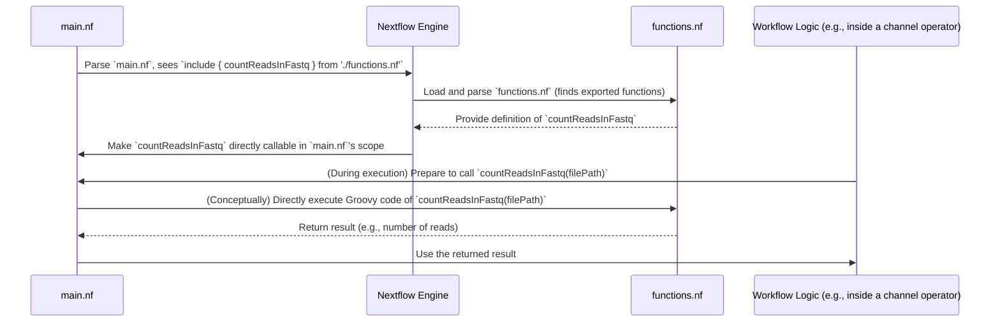

# Chapter 7: Utility Functions

In [Chapter 6: Modular Components (Modules)](06_modular_components__modules__.md), we learned how to organize our pipeline code into reusable [Process Execution Unit](04_process_execution_unit_.md)s and sub-workflows using module files. This helps keep our `main.nf` script tidy and makes our pipeline components shareable. But what if you need to perform a small, custom task – like counting items, formatting a piece of text, or performing a simple calculation – that doesn't seem big enough for a whole `process`? This is where **Utility Functions** shine!

## What Problem Do Utility Functions Solve? The Need for Small Helpers

Imagine you're preparing your DNA sequence files (FASTQ files) for a big analysis. Before you run a time-consuming alignment process, you might want to quickly log how many DNA sequences (reads) are in each input file. This is a simple counting task. Creating an entire Nextflow `process` just to count lines in a file might feel like using a sledgehammer to crack a nut – it's a bit too much machinery for such a small job.

**Utility Functions** in Nextflow are like small, specialized tools in your workshop. Think of them as custom-made Allen keys or a perfectly shaped small file. They are designed to perform specific, repeatable tasks that are too minor for a full-blown [Process Execution Unit](04_process_execution_unit_.md).

These functions allow you to:
*   **Encapsulate small pieces of custom logic.**
*   **Reuse this logic easily** within your workflow definitions or when manipulating data in [Channels (Data Flow)](03_channel__data_flow__.md).
*   **Keep your main workflow script cleaner** by moving these helper operations into separate, organized files.

Our central use case: **Count the number of reads in a FASTQ file directly within our workflow logic for logging purposes.**

## What is a Utility Function? Your Custom Groovy Tools

A Utility Function in Nextflow is simply a custom function written in **Groovy** (the programming language Nextflow is built on). You can define these functions and then call them from various parts of your Nextflow script, most commonly from within the `workflow` block or when working with channel operators.

*   **They are Groovy code**: If you know some basic Groovy (or Java, as Groovy is very similar), you can write these functions. Even if not, many common tasks are simple enough to pick up quickly.
*   **They live in `.nf` files**: Just like modules, you typically define these functions in a separate `.nf` file (e.g., `functions.nf` or `lib.nf`).
*   **They are imported**: You use the `include` keyword to bring them into your main script, similar to how you import module components.

## Creating a Simple Utility Function

Let's start by creating a file for our utility functions. It's a good practice to put this in the root of your project or in a dedicated `lib/` or `modules/` directory. For our project, we have a `functions.nf` file.

**Step 1: Define the Function in a File**

Let's create a file named `functions.nf` and define our `countReadsInFastq` function. Remember, a FASTQ file stores sequence data, and each sequence (or "read") typically takes up 4 lines.

```groovy
// File: functions.nf

// Function to count sequence lines in a FASTQ file
// Returns the number of sequences (reads)
def countReadsInFastq(fastqFile) {
    // `fastqFile` is expected to be a Nextflow Path object
    // or a string that can be converted to a file

    // For robustness, handle if fastqFile is a string path
    def fileToProcess = fastqFile instanceof String ? file(fastqFile) : fastqFile
    
    // Check if the file actually exists
    if (!fileToProcess.exists()) {
        println "WARN: File not found: ${fileToProcess}"
        return 0 // Return 0 if file doesn't exist
    }
    
    def lineCount = 0
    fileToProcess.eachLine { line -> lineCount++ } // Count all lines
    
    return lineCount / 4 // Each read is 4 lines
}
```
*   `def countReadsInFastq(fastqFile)`: This defines a Groovy function named `countReadsInFastq` that takes one argument, `fastqFile`.
*   `fastqFile instanceof String ? file(fastqFile) : fastqFile`: This line makes our function more flexible. If `fastqFile` is already a Nextflow `Path` object, it uses it directly. If it's a string (like a file name), it converts it into a `Path` object using `file()`.
*   `if (!fileToProcess.exists()) { ... }`: A good practice check to ensure the file is there.
*   `fileToProcess.eachLine { line -> lineCount++ }`: This Groovy code reads the file line by line and increments `lineCount`.
*   `return lineCount / 4`: It returns the total line count divided by 4.

**Step 2: Make the Function "Exportable"**

To make functions from `functions.nf` available for import in other Nextflow scripts (like `main.nf`), you need to add a special `return` statement at the end of the `functions.nf` file:

```groovy
// File: functions.nf
// ... (function definitions like countReadsInFastq above) ...

// This makes the functions available for import
return [
    countReadsInFastq: this.&countReadsInFastq
    // If you had other functions, you'd add them here:
    // anotherFunction: this.&anotherFunction
]
```
*   `return [ functionName: this.&functionName ]`: This Groovy map syntax tells Nextflow which functions defined in this file should be "exported" or made available for `include`. `this.&functionName` is the Groovy way to get a reference to the function.

Our project's `functions.nf` already has this structure.

## Importing and Using Utility Functions

Now that we have our `functions.nf` file with the `countReadsInFastq` function defined and exportable, let's use it in our `main.nf`.

**Step 1: Import the Function in `main.nf`**

Just like with modules, you use the `include` keyword:

```nextflow
// In main.nf, usually near the top with other includes
nextflow.enable.dsl=2

// ... other includes for modules like fastp_trim ...

// Import our utility function
include { countReadsInFastq } from './functions.nf'
```
*   `include { countReadsInFastq } from './functions.nf'`: This tells Nextflow to load the `countReadsInFastq` function from the `functions.nf` file located in the same directory as `main.nf`.

**Step 2: Call the Function in Your Workflow**

Once imported, you can call `countReadsInFastq` like any other function within your workflow logic. A common place to use such functions is with [Channel (Data Flow)](03_channel__data_flow__.md) operators like `map` or `subscribe` (which lets you "peek" at channel items as they flow).

Let's imagine a simplified part of a workflow where we have a channel emitting FASTQ file paths:

```nextflow
// In main.nf (simplified workflow example)
workflow MY_ANALYSIS {
    // Pretend this channel emits Path objects to FASTQ files
    // e.g., item could be file('/path/to/sampleA_R1.fastq')
    raw_reads_channel = Channel.fromPath("data/reads/*_R1.fastq") 

    // Use 'subscribe' to act on each item without changing the channel
    raw_reads_channel.subscribe { fastq_file_path ->
        // Call our utility function!
        def numberOfReads = countReadsInFastq(fastq_file_path)
        
        println "[INFO] File '${fastq_file_path.name}' contains ${numberOfReads} reads."
    }

    // The raw_reads_channel can still be used by other processes here
    // SOME_PROCESS(raw_reads_channel) 
}
```
*   `raw_reads_channel.subscribe { fastq_file_path -> ... }`: The `subscribe` operator allows us to run some code for each item (`fastq_file_path`) emitted by `raw_reads_channel`. The channel itself remains unchanged and can be used later.
*   `def numberOfReads = countReadsInFastq(fastq_file_path)`: Here's the call to our imported utility function! It passes the file path from the channel to the function.
*   `println "[INFO] File '${fastq_file_path.name}' contains ${numberOfReads} reads."`: We then print the result.

If you had a file `data/reads/sampleA_R1.fastq` with 400 lines (meaning 100 reads), when this part of the workflow runs for that file, you'd see output like:
```
[INFO] File 'sampleA_R1.fastq' contains 100 reads.
```

This is exactly what our use case aimed for: counting reads for logging without a full `process`.

## How Utility Functions Work: A Peek Under the Hood

Utility functions are simpler in their execution compared to Nextflow [Process Execution Unit](04_process_execution_unit_.md)s.

1.  **Parsing and Loading**: When Nextflow parses your `main.nf` (or any `.nf` script), and it encounters an `include { myFunction } from './functions.nf'` statement:
    *   It locates the `functions.nf` file.
    *   It reads this file and, thanks to the `return [myFunction: this.&myFunction]` statement, identifies `myFunction` as an available Groovy function.
2.  **Making Functions Available**: Nextflow essentially makes these Groovy functions part of the "execution context" of the script that included them. They become directly callable.
3.  **Direct Execution**: When your workflow logic calls `myFunction(some_argument)`, it's a direct call to that Groovy function.
    *   There's no separate job submission (like with `process`).
    *   There's no isolated working directory or file staging.
    *   The function runs within the main Nextflow Java Virtual Machine (JVM) process that is orchestrating the pipeline.

This makes utility functions very lightweight for small tasks but also means they shouldn't be used for long-running, resource-intensive computations, or tasks that require specific external software tools (that's what processes are for, with their container support and resource management).

Let's visualize this with a simplified sequence diagram:


This diagram shows that the function call is a more direct, internal affair compared to launching a separate Nextflow process.

## Utility Functions in Our Project

Our course project uses the `countReadsInFastq` utility function, which we've already discussed.

**1. Definition in `functions.nf`:**
As seen before, `functions.nf` contains:
```groovy
// File: functions.nf
def countReadsInFastq(fastqFile) {
    // ... (implementation as shown above) ...
    def file = fastqFile instanceof String ? file(fastqFile) : fastqFile
    if (!file.exists()) { return 0 }
    def lines = file.readLines()
    return lines.size() / 4 
}

return [
    countReadsInFastq: this.&countReadsInFastq
]
```

**2. Import in `main.nf`:**
At the top of `main.nf`:
```nextflow
// File: main.nf
// ... (other includes) ...
include { countReadsInFastq } from './functions.nf'
```

**3. Usage in the `process_reads` sub-workflow in `main.nf`:**
The `process_reads` sub-workflow uses this function to log the number of reads before and after trimming:

```nextflow
// File: main.nf (inside workflow process_reads)
workflow process_reads {
    take:
        input_channel  // (id, read1, read2)
    
    main:
        // Count reads in input files
        input_channel.subscribe { id, r1, r2 ->
            def r1_count = countReadsInFastq(r1) // Call for read1
            println "[READ COUNT] Input file ${r1.name}: ${r1_count} reads"
            
            if (r2) { // If read2 exists (paired-end)
                def r2_count = countReadsInFastq(r2) // Call for read2
                println "[READ COUNT] Input file ${r2.name}: ${r2_count} reads"
            }
        }
        
        // ... (fastqc_raw_wf, fastp_trim processes) ...
        trimming = fastp_trim(input_channel)
        
        // Count reads in trimmed files
        trimming.out.subscribe { id, tr1, tr2 -> // 'trimming' is the process, so use trimming.out
            def tr1_count = countReadsInFastq(tr1) // Call for trimmed read1
            println "[READ COUNT] Trimmed file ${tr1.name}: ${tr1_count} reads"
            
            if (tr2) {
                def tr2_count = countReadsInFastq(tr2) // Call for trimmed read2
                println "[READ COUNT] Trimmed file ${tr2.name}: ${tr2_count} reads"
            }
        }
        // ... (fastqc_trimmed_wf) ...
    // ...
}
```
Here, `countReadsInFastq` is called within the `subscribe` operator on the `input_channel` (which contains the raw reads) and on the output channel of the `fastp_trim` process (which contains the trimmed reads). This provides useful logging information directly in the console output about how many reads are present at different stages.

## When to Use (and Not Use) Utility Functions

**Use Utility Functions For:**
*   Simple data manipulations (e.g., formatting a string, extracting a part of a filename).
*   Small calculations (e.g., averaging, simple statistics on metadata).
*   Custom logic within channel operators (`map`, `filter`, `flatMap`, `subscribe`).
*   Code that needs to be reused across different parts of your workflow script but is too small for a full `process`.
*   Tasks that don't involve running external command-line tools.

**Avoid Using Utility Functions For:**
*   Running external bioinformatics tools or any command-line programs (use a `process` for this).
*   Resource-intensive computations (CPU or memory heavy) that could slow down the main Nextflow pipeline engine (use a `process`).
*   Tasks that need strict isolation or specific software environments (processes with containers are better).

Think of them as quick, internal helpers, not replacements for the robust, isolated execution environment that [Process Execution Unit](04_process_execution_unit_.md)s provide.

## Conclusion

Utility Functions are a handy feature in Nextflow for adding small, custom pieces of Groovy code to your pipeline. They help you:
*   Encapsulate simple, reusable logic.
*   Perform minor calculations or data transformations directly within your workflow.
*   Keep your main pipeline scripts cleaner and more focused.

You've learned how to define these functions in a separate file, make them exportable, import them into your main script, and call them – for example, to implement our read counting use case.

Congratulations! You've now journeyed through the fundamental concepts of Nextflow, from [Workflow Orchestration](01_workflow_orchestration_.md) and [Pipeline Parameters (`params`)](02_pipeline_parameters___params___.md), through [Channel (Data Flow)](03_channel__data_flow__.md)s and [Process Execution Unit](04_process_execution_unit_.md)s, to managing [Configuration (`nextflow.config`)](05_configuration___nextflow_config___.md), building [Modular Components (Modules)](06_modular_components__modules__.md), and now, using Utility Functions. With these building blocks, you are well-equipped to start creating, understanding, and running your own powerful and reproducible Nextflow pipelines!

For more advanced topics, deeper dives into specific operators, or exploring features like cloud execution and custom plugins, the official Nextflow documentation is an excellent resource to continue your learning journey. Happy pipelining!

---

Generated by [AI Codebase Knowledge Builder](https://github.com/The-Pocket/Tutorial-Codebase-Knowledge)